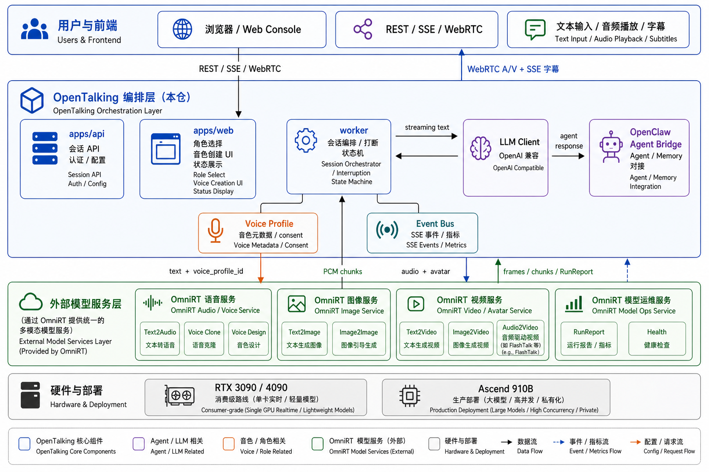

<h1 align="center">OpenTalking</h1>

<p align="center">
  <b>面向实时对话的开源数字人产线：LLM、TTS、WebRTC、角色音色与外部 OmniRT 模型服务</b>
</p>

<p align="center">
  <a href="./README.en.md">English</a> ·
  <a href="https://github.com/datascale-ai/opentalking">GitHub</a>
</p>

<p align="center">
  <a href="LICENSE"></a>
  
  
  
  
</p>

<p align="center">
  <a href="#当前能力">当前能力</a> ·
  <a href="#交流与联系">交流与联系</a> ·
  <a href="#视频展示位">视频展示位</a> ·
  <a href="#系统架构">系统架构</a> ·
  <a href="#快速开始">快速开始</a> ·
  <a href="#roadmap">Roadmap</a> ·
  <a href="#致谢">致谢</a>
</p>

---

## 项目简介

OpenTalking 是一个开源实时数字人框架，目标是把 **数字人对话产品** 需要的链路串起来：前端交互、会话状态、LLM 回复、TTS/音色选择、打断控制、字幕事件、WebRTC 音视频播放，以及外部模型服务调用。

OpenTalking 关注的是 **产线编排层**，支持调用外部 API 和本地部署模型。基于 [OmniRT](https://github.com/datascale-ai/omnirt) 数字人推理框架，支持两条部署路线：

- **消费级显卡可用**：面向 RTX 3090 / 4090，提供轻量模型、单卡实时配置和完整端到端体验。
- **高质量私有化部署**：面向企业内网、私有数据和高质量数字人表现，支持昇腾 910B 等企业级 GPU/NPU 推理服务。

## 当前能力

- **实时数字人对话**：LLM 回复、流式 TTS、字幕事件、状态事件和 WebRTC 播放在一条链路中完成。
- **FlashTalk 兼容路径**：支持本地或远端 FlashTalk 风格推理服务，作为高质量数字人渲染后端。
- **轻量 Demo 路径**：无需先下载完整 FlashTalk 权重，也可以跑通 API、TTS、WebRTC 和前端体验。
- **基础打断能力**：当前说话轮次已有打断基础，后续会升级为全链路取消。
- **OpenAI 兼容 LLM**：支持 DashScope、Ollama、vLLM、DeepSeek 等 OpenAI-compatible endpoint。
- **多部署形态**：支持单进程 demo、API/Worker 分布式模式和 Docker Compose。

## 交流与联系

欢迎加入 QQ 交流群，讨论实时数字人、FlashTalk、OmniRT、模型部署和产品场景。

<p align="center">
  
</p>

<p align="center">
  <b>AI 数字人交流群</b> · 群号：<code>1103327938</code>
</p>

## 视频展示位

这里预留 6 个视频位置，用来展示 OpenTalking 产线的不同可能性。视频准备好后，可以把 MP4/WebM 放到 `assets/demo/` 下，并替换下方路径。

| 场景 | 视频路径 | 展示重点 |
| --- | --- | --- |
| 实时手机录制 | `assets/demo/realtime-mobile.mp4` | 手机实拍实时对话，展示低延迟、打断和端到端稳定性。 |
| 动漫脱口秀 | `assets/demo/anime-standup.mp4` | 动漫角色说脱口秀，展示角色风格、表情和长段口播。 |
| 电商带货 | `assets/demo/ecommerce.mp4` | 商品介绍、价格讲解、互动式销售话术。 |
| 新闻女主播 | `assets/demo/news-anchor.mp4` | 稳定正脸播报、字幕同步、职业化语气。 |
| 创意演唱 / 模仿秀 | `assets/demo/singing-parody.mp4` | 歌唱或模仿类创意内容，建议使用授权或虚构形象。 |
| 陪伴类角色 | `assets/demo/companion.mp4` | 甜美女生说安慰话术，配合温柔表情和情绪表达。 |

<!--
视频文件就绪后，可以使用下面的 HTML 直接展示：

<video src="assets/demo/realtime-mobile.mp4" controls width="32%"></video>
<video src="assets/demo/anime-standup.mp4" controls width="32%"></video>
<video src="assets/demo/ecommerce.mp4" controls width="32%"></video>
<video src="assets/demo/news-anchor.mp4" controls width="32%"></video>
<video src="assets/demo/singing-parody.mp4" controls width="32%"></video>
<video src="assets/demo/companion.mp4" controls width="32%"></video>
-->

## 系统架构



## 项目结构

```text
opentalking/
├── src/opentalking/
│   ├── core/         # 配置、接口协议、类型定义
│   ├── engine/       # FlashTalk 兼容本地推理路径
│   ├── server/       # 分布式 WebSocket 推理服务
│   ├── models/       # Avatar 模型适配器
│   ├── worker/       # 会话编排
│   ├── llm/          # OpenAI 兼容 LLM 客户端
│   ├── tts/          # TTS 适配器
│   ├── rtc/          # WebRTC 传输
│   ├── voices/       # 音色 profile 和 provider 接入
│   └── events/       # SSE 和运行时事件
├── apps/
│   ├── api/          # FastAPI 服务
│   ├── unified/      # 单进程模式
│   ├── web/          # React 前端
│   └── cli/          # 模型下载、视频生成、demo 工具
├── configs/          # YAML 配置示例
├── docker/           # Docker Compose
├── scripts/          # 启动和部署脚本
├── tests/            # 单元测试 / 集成测试
└── docs/             # 文档
```

## 快速开始

OpenTalking 默认 avatar 模型是 `flashtalk`，为了帮助大家快速体验，整条链路只需要本地部署 **一个** 模型服务（FlashTalk WebSocket）；LLM、STT、TTS 全部走阿里云百炼 API（OpenAI 兼容端点 + DashScope 实时 ASR/TTS），也可无痛切换为自己启动或者OmniRT部署的自定义模型服务。完整安装说明、模型权重下载和分布式部署见 [docs/quickstart.md](docs/quickstart.md)、[docs/deployment.md](docs/deployment.md) 和 [docs/hardware.md](docs/hardware.md)。

### 1. 准备 OpenTalking 编排层

```bash
git clone https://github.com/datascale-ai/opentalking.git
cd opentalking

python3 -m venv .venv
source .venv/bin/activate

pip install -e ".[dev]"
cp .env.example .env
```

在 [bailian.console.aliyun.com](https://bailian.console.aliyun.com/) 申请百炼 API Key，然后在 `.env` 里补上密钥（其它字段保持默认即可）：

```env
# LLM：百炼 OpenAI-compatible endpoint
OPENTALKING_LLM_BASE_URL=https://dashscope.aliyuncs.com/compatible-mode/v1
OPENTALKING_LLM_API_KEY=sk-your-dashscope-key
OPENTALKING_LLM_MODEL=qwen-flash

# STT：百炼 Paraformer realtime
DASHSCOPE_API_KEY=sk-your-dashscope-key
OPENTALKING_STT_MODEL=paraformer-realtime-v2

# TTS：默认 Edge TTS，无需 key
OPENTALKING_TTS_PROVIDER=edge
OPENTALKING_TTS_VOICE=zh-CN-XiaoxiaoNeural

# 可选：切到百炼 Qwen realtime TTS（复用上面的 DASHSCOPE_API_KEY）
# OPENTALKING_TTS_PROVIDER=dashscope
# OPENTALKING_QWEN_TTS_MODEL=qwen3-tts-flash-realtime

# FlashTalk WebSocket 后端
OPENTALKING_FLASHTALK_MODE=remote
OPENTALKING_FLASHTALK_WS_URL=ws://127.0.0.1:8765
```

### 2. 用 OmniRT 启动 FlashTalk 模型服务

我们推荐用 [OmniRT](https://github.com/datascale-ai/omnirt) 部署 FlashTalk-compatible WebSocket，默认监听 `ws://0.0.0.0:8765`，正好对应 OpenTalking 的 `OPENTALKING_FLASHTALK_WS_URL`，无需改 OpenTalking 配置。

完整流程（venv、`torch_npu`、SoulX-FlashTalk 依赖、模型权重、`bash scripts/start_flashtalk_ws.sh` 的所有环境变量、后台启动 / 量化 / warmup / 排错）直接照 OmniRT 官方文档操作：

OmniRT 官方文档：[omnirt/docs/user_guide/serving/flashtalk_ws.md](https://github.com/datascale-ai/omnirt/blob/main/docs/user_guide/serving/flashtalk_ws.md)

> 同机部署：保持 `OPENTALKING_FLASHTALK_WS_URL=ws://127.0.0.1:8765` 即可。跨机部署：在 OmniRT 侧设 `OMNIRT_FLASHTALK_HOST=0.0.0.0`，把 OpenTalking 这边的 WS URL 指向那台机器。

### 3. 启动 OpenTalking 与前端

确认 FlashTalk WS 已经就绪后，回到 OpenTalking 仓再开两个终端：

```bash
# 终端 1：后端
cd opentalking
source .venv/bin/activate
bash scripts/start_unified.sh

# 终端 2：前端
cd opentalking/apps/web
npm ci
npm run dev -- --host 0.0.0.0
```

打开 `http://localhost:5173`。

环境要求：Python ≥ 3.9、Node.js ≥ 18、FFmpeg；分布式模式额外需要 Redis。

### 模型支持

OmniRT 提供的高质量数字人模型（详见 [omnirt/docs/user_guide/generation/talking_head.md](https://github.com/datascale-ai/omnirt/blob/main/docs/user_guide/generation/talking_head.md)）：

| 模型 | 输入 | 硬件 | OpenTalking 接入 |
| --- | --- | --- | --- |
| `soulx-flashtalk-14b`（默认） | portrait + audio | ≥ 20 GB 显存 | OmniRT FlashTalk WebSocket，`OPENTALKING_DEFAULT_MODEL=flashtalk` |
| `soulx-flashhead-1.3b` | portrait + audio | ≥ 48 GB 聚合显存 | OmniRT 当前仅暴露 HTTP `/v1/generate`，OpenTalking WebSocket 适配计划中 |
| `soulx-liveact-14b` | portrait + audio | 4 卡 Ascend 910B 推荐 | 同上 |

OpenTalking 内置轻量适配（不依赖 OmniRT，进程内运行，适合无大显存机器的 demo 体验）：

| 模型 | 用途 |
| --- | --- |
| `wav2lip` | 轻量口型同步 demo / fallback；无需独立模型服务 |
| `musetalk` | 轻量 talking-head 适配验证 |

> 仅想跑通 API / TTS / WebRTC / 前端、不部署任何模型后端：设 `OPENTALKING_FLASHTALK_MODE=off`，使用 `demo-avatar / wav2lip` 路径即可。


## Roadmap

- [x] **实时数字人基础体验**  
  Web 控制台、LLM 对话、TTS、字幕事件、WebRTC 音视频播放。

- [~] **更自然的实时对话**  
  支持打断、会话状态、低延迟响应、音画同步和异常恢复。

- [ ] **OmniRT 模型服务接入**  
  通过 OmniRT 统一调用 FlashTalk、轻量 talking-head、ASR、语音合成和音色服务。

- [ ] **消费级显卡可用**  
  面向 RTX 3090 / 4090 提供轻量模型、单卡实时配置和端到端 benchmark。

- [~] **高质量私有化部署**  
  面向企业私有化场景，支持外部 OmniRT 推理服务、容量调度、健康检查和生产监控；昇腾 910B 等企业级 GPU/NPU 路线已在构建中。

- [ ] **自定义角色和音色**  
  支持角色配置、内置音色选择、上传参考音频、自然语言描述音色，并通过 OmniRT 生成语音。

- [ ] **Agent 与记忆能力**  
  对接 OpenClaw 或外部 Agent，复用其 memory、工具调用和知识库能力。

- [ ] **生产级平台能力**  
  多会话调度、观测指标、安全合规、授权音色、合成内容标识。

## 文档

- [快速开始](docs/quickstart.md)
- [架构说明](docs/architecture.md)
- [配置说明](docs/configuration.md)
- [部署文档](docs/deployment.md)（Docker Compose、分布式部署）
- [硬件指南](docs/hardware.md)
- [模型适配](docs/model-adapter.md)
- [贡献指南](CONTRIBUTING.md)（开发环境、CLI 工具、ruff / mypy / pytest）

## 致谢

OpenTalking 参考并受益于实时数字人生态中的优秀项目：

- [SoulX-FlashTalk](https://github.com/Soul-AILab/SoulX-FlashTalk) 和 [SoulX-FlashTalk-14B](https://huggingface.co/Soul-AILab/SoulX-FlashTalk-14B)
- [LiveTalking](https://github.com/lipku/LiveTalking)
- [OmniRT](https://github.com/datascale-ai/omnirt)
- [Edge TTS](https://github.com/rany2/edge-tts)
- [aiortc](https://github.com/aiortc/aiortc)
- [Wan Video](https://github.com/Wan-Video)

## License

[Apache License 2.0](LICENSE)
