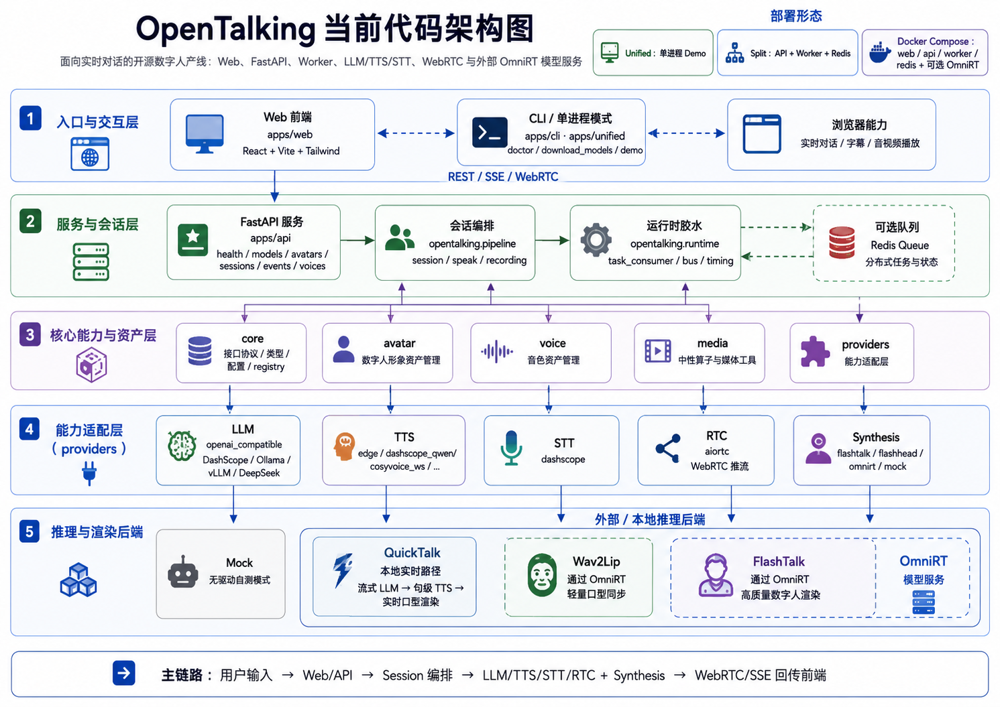

<h1 align="center">OpenTalking</h1>

<p align="center">
  <b>面向实时对话的开源数字人产线：LLM、TTS、WebRTC、角色音色与可插拔模型后端</b>
</p>

<p align="center">
  <a href="./README.en.md">English</a> ·
  <a href="https://datascale-ai.github.io/opentalking/">📖 文档站</a> ·
  <a href="https://github.com/datascale-ai/opentalking">GitHub</a>
</p>

<p align="center">
  <a href="LICENSE"></a>
  
  
  
  
</p>

<p align="center">
  <a href="#当前能力">当前能力</a> ·
  <a href="#视频展示">视频展示</a> ·
  <a href="#系统架构">系统架构</a> ·
  <a href="#快速开始">快速开始</a> ·
  <a href="#roadmap">Roadmap</a> ·
  <a href="#文档">文档</a> ·
  <a href="#交流与联系">交流与联系</a> ·
  <a href="#致谢">致谢</a>
</p>

---

## 项目简介

OpenTalking 是一个开源实时数字人框架，目标是把 **数字人对话产品** 需要的链路串起来：前端交互、会话状态、LLM 回复、TTS/音色选择、打断控制、字幕事件、WebRTC 音视频播放，以及外部模型服务调用。

OpenTalking 关注的是 **产线编排层**，支持调用外部 API 和本地部署模型。默认入口优先让新用户先跑通完整链路，再按需要升级模型能力：

- **快速体验**：`mock / 无驱动模式`，不需要独立模型服务，适合第一次验证 API、TTS、WebRTC 和前端。
- **轻量适配验证**：`wav2lip` / `musetalk` 可按配置选择本地、单模型直连或 OmniRT 后端，用于验证 Avatar 资产格式、模型适配器和端到端编排。
- **QuickTalk 实时路径**：`quicktalk` 本地适配器，支持流式 LLM → 句级 TTS → 实时口型渲染，并可通过 Worker 缓存降低首轮等待。
- **高质量部署**：通过 OmniRT 接入 `flashtalk` 等高质量模型，面向 GPU/NPU 私有化推理服务。

- 在线文档固定地址：<https://datascale-ai.github.io/opentalking/>
- 英文文档入口：<https://datascale-ai.github.io/opentalking/en/>

## 当前能力

- **实时数字人对话**：LLM 回复、流式 TTS、字幕事件、状态事件和 WebRTC 播放在一条链路中完成。
- **FlashTalk 兼容路径**：支持本地或远端 FlashTalk 风格推理服务，作为高质量数字人渲染后端。
- **轻量 Demo 路径**：无需先下载完整 FlashTalk 权重，也可以跑通 API、TTS、WebRTC 和前端体验。
- **基础打断能力**：当前说话轮次已有打断基础，后续会升级为全链路取消。
- **OpenAI 兼容 LLM**：支持 DashScope、Ollama、vLLM、DeepSeek 等 OpenAI-compatible endpoint。
- **多部署形态**：支持单进程 demo、API/Worker 分布式模式和 Docker Compose。
- **QuickTalk 适配器**：内置 `quicktalk` 模型注册、Avatar 校验、实时渲染队列、音画同步和 benchmark CLI。

## 数字人服务界面

OpenTalking 提供 Web 服务界面，用于管理数字人对话链路：可以选择或新建数字人物，配置音色、LLM、TTS、STT 和数字人驱动模型，查看模型连接状态，并在同一页面完成实时对话、字幕和音视频播放验证。


## 视频展示

以下是 OpenTalking 典型场景演示视频，用来展示实时数字人产线在不同内容形态下的表现。横屏示例单独占一行，其余为竖屏，避免同一行里行高被横屏拉高导致竖屏看起来像被裁切。

<table>
  <tr>
    <td align="center" colspan="3">
      <b>实时手机录制</b><br/>
      <video src="https://github.com/user-attachments/assets/a3abce76-12c0-4b8b-844f-bbc5c3227dc7" controls width="100%"></video><br/>
    </td>
  </tr>
  <tr>
    <td align="center" valign="top" width="33%">
      <b>动漫脱口秀</b><br/>
      <video src="https://github.com/user-attachments/assets/b3743604-7f50-40d1-9248-f2df80ea7308" controls width="100%"></video><br/>
    </td>
    <td align="center" valign="top" width="33%">
      <b>电商带货</b><br/>
      <video src="https://github.com/user-attachments/assets/826c777b-a9d2-49be-a1a0-b295c8a4b498" controls width="100%"></video><br/>
    </td>
    <td align="center" valign="top" width="33%">
      <b>新闻女主播</b><br/>
      <video src="https://github.com/user-attachments/assets/34a282da-84cb-4134-bc4b-644356ac4f6f" controls width="100%"></video><br/>
    </td>
  </tr>
  <tr>
    <td align="center" valign="top" colspan="3">
      <table>
        <tr>
          <td align="center" valign="top" width="50%">
            <b>创意演唱 / 模仿秀</b><br/>
            <video src="https://github.com/user-attachments/assets/98e813c2-f170-4cc8-b934-a77a72061d2e" controls width="100%"></video><br/>
          </td>
          <td align="center" valign="top" width="50%">
            <b>陪伴类角色</b><br/>
            <video src="https://github.com/user-attachments/assets/44bbf1d9-75b1-4b0a-9704-c7f81c39446e" controls width="100%"></video><br/>
          </td>
        </tr>
      </table>
    </td>
  </tr>
</table>

## 系统架构



## 项目结构

```text
opentalking/
├── opentalking/                  # 编排层 Python 包（flat layout，根目录直接 import）
│   ├── core/                     # 接口协议、类型、配置、registry
│   ├── providers/                # 能力适配器（按"能力域 / 提供方"两级）
│   │   ├── stt/dashscope/        # 语音识别
│   │   ├── tts/{edge,dashscope_qwen,cosyvoice_ws,...}/   # 语音合成 + 复刻
│   │   ├── llm/openai_compatible/                        # 大语言模型
│   │   ├── rtc/aiortc/                                   # WebRTC 推流
│   │   └── synthesis/{flashtalk,flashhead,omnirt,mock}/  # 数字人合成（thin client）
│   ├── avatar/                   # 数字人形象资产管理
│   ├── voice/                    # 音色资产管理
│   ├── media/                    # 中性算子工具
│   ├── pipeline/{session,speak,recording}/   # 业务编排
│   └── runtime/                  # 进程胶水（task_consumer / bus / timing）
├── apps/
│   ├── api/                      # FastAPI 服务
│   ├── unified/                  # 单进程模式（开发友好）
│   ├── web/                      # React 前端
│   └── cli/                      # download_models / doctor / ...
├── configs/                      # YAML 配置（profiles / inference / synthesis）
├── docker/ + docker-compose.yml  # 容器化部署
├── scripts/                      # 辅助脚本（run_omnirt.sh / prepare-avatar.sh）
├── tests/                        # 单元 / 集成测试
└── docs/                         # 文档
```

## 快速开始

OpenTalking 的 **编排层**（API / Worker / 前端）和 **数字人合成 backend**（`mock`、`local`、`direct_ws` 或 [OmniRT](https://github.com/datascale-ai/omnirt)）可以独立部署。先用 Mock 跑通完整链路，再按需求切到 Wav2Lip、QuickTalk 或 FlashTalk。

### 0. 安装编排层

```bash
git clone https://github.com/datascale-ai/opentalking.git && cd opentalking
uv sync --extra dev --python 3.11
source .venv/bin/activate
cp .env.example .env
```

要求：Python 3.10+（推荐 3.11）、Node.js 18+、FFmpeg。若环境不便使用 `uv`，可用兼容安装：

```bash
python3 -m venv .venv
source .venv/bin/activate
pip install --index-url https://pypi.tuna.tsinghua.edu.cn/simple -e ".[dev]"
```

编辑 `.env`，至少配置 LLM / TTS；`edge` TTS 不需要 key：

```env
# LLM模型配置（百炼、DeepSeek、豆包等）
OPENTALKING_LLM_BASE_URL=https://dashscope.aliyuncs.com/compatible-mode/v1
OPENTALKING_LLM_API_KEY=sk-your-key
OPENTALKING_LLM_MODEL=qwen-flash

# 声音合成/声音复刻（若使用百炼后端）
DASHSCOPE_API_KEY=sk-your-key

# 其他声音合成选项
OPENTALKING_TTS_PROVIDER=edge
OPENTALKING_TTS_VOICE=zh-CN-XiaoxiaoNeural
```

运行 `opentalking-doctor` 可以检查本机依赖状态。

### 路径 1：快速体验（推荐首次运行）

目标：不下载模型权重、不启动 OmniRT，先验证前端、API、LLM、TTS、STT、WebRTC 和浏览器链路。数字人画面使用内置 Mock 静态帧，LLM 回复、流式 TTS、字幕事件和 WebRTC 传输仍是真链路。

```bash
bash scripts/quickstart/start_mock.sh
```

默认前端地址是 `http://localhost:5173`。如果需要改端口：

```bash
bash scripts/quickstart/start_mock.sh --api-port 8010 --web-port 5180
```

停止 helper 管理的服务：

```bash
bash scripts/quickstart/stop_all.sh
```

### 路径 2：轻量模型验证

目标：验证 Avatar 资产、模型适配器和真实口型同步。轻量模型可走本地 adapter、单模型直连 WebSocket，或当前最稳妥的 OmniRT 兼容路径。

先在同级目录安装 OmniRT，并把 Wav2Lip 权重放到 `$OMNIRT_MODEL_ROOT/wav2lip/`：

```bash
export DIGITAL_HUMAN_HOME=/opt/digital_human
export OMNIRT_MODEL_ROOT="$DIGITAL_HUMAN_HOME/models"

mkdir -p "$DIGITAL_HUMAN_HOME"
cd "$DIGITAL_HUMAN_HOME"
git clone https://github.com/datascale-ai/omnirt.git
cd omnirt
uv sync --extra server --python 3.11
source .venv/bin/activate
uv pip install -U "huggingface_hub[cli]"

export HF_ENDPOINT=https://hf-mirror.com
hf auth login
mkdir -p "$OMNIRT_MODEL_ROOT/wav2lip"
hf download Pypa/wav2lip384 \
  wav2lip384.pth \
  --local-dir "$OMNIRT_MODEL_ROOT/wav2lip"
hf download rippertnt/wav2lip \
  s3fd.pth \
  --local-dir "$OMNIRT_MODEL_ROOT/wav2lip"
```

启动 Wav2Lip 兼容路径，再启动 OpenTalking：

```bash
cd "$DIGITAL_HUMAN_HOME/opentalking"
bash scripts/quickstart/start_omnirt_wav2lip.sh --device cuda
curl http://127.0.0.1:9000/v1/audio2video/models
bash scripts/quickstart/start_all.sh --omnirt http://127.0.0.1:9000
```

如需自定义端口：

```bash
bash scripts/quickstart/start_all.sh \
  --omnirt http://127.0.0.1:9000 \
  --api-port 8010 \
  --web-port 5180
```

如果 OmniRT 在远端 GPU / NPU 机器，把 `--omnirt` 改成 `http://<gpu-or-npu-server-ip>:9000`。

### 路径 3：高质量私有化部署

目标：运行 FlashTalk 14B / FlashHead 等高质量模型，面向私有化或生产环境。仍使用 `OMNIRT_ENDPOINT`，但建议启用 API / Worker 分离、Redis 和独立前端构建。

```env
OMNIRT_ENDPOINT=http://<gpu-host>:9000
OMNIRT_API_KEY=sk-omnirt-xxx           # 如果你的 OmniRT 开启鉴权
OPENTALKING_DEFAULT_MODEL=flashtalk     # 或 flashhead
OPENTALKING_REDIS_URL=redis://redis:6379/0
```

```bash
opentalking-api &
opentalking-worker &
cd apps/web && npm ci && npm run build
```

Ascend 910B 可使用薄部署 wrapper：

```bash
source /usr/local/Ascend/ascend-toolkit/set_env.sh
bash scripts/deploy_ascend_910b.sh
```

### 三种路径速览

| 路径 | 推理 backend | GPU | 适合场景 |
| --- | --- | --- | --- |
| 快速体验 | 内置 Mock | 不需要 | 首次运行、前端调试、主链路验证 |
| 轻量模型验证 | Local / direct WS / OmniRT lightweight model | 入门级 GPU 起 | Avatar / 模型适配开发 |
| QuickTalk 实时路径 | Local QuickTalk adapter | CUDA GPU | 本地实时数字人和 LLM 对话 demo |
| 高质量部署 | OmniRT + FlashTalk / FlashHead | 4090 / 910B | 私有化、生产、高质量画面 |

### 支持模型

| 模型 | 输入 | OpenTalking 集成方式 | 推荐路径 |
| --- | --- | --- | --- |
| `mock` | 参考图 | 内置静态帧 | 快速体验 |
| `wav2lip` | frames + audio | 可插拔轻量口型 backend；local / direct backend 优先，OmniRT 作为兼容路径 | 轻量模型验证 |
| `musetalk` | full frames + audio | 可插拔轻量 talking-head backend | 轻量模型验证 |
| `quicktalk` | template video + audio | 本地实时 adapter，支持 Worker 缓存和 `/chat` | QuickTalk 实时路径 |
| `soulx-flashtalk-14b` | portrait + audio | OmniRT 高质量 FlashTalk | 高质量部署 |
| `soulx-flashhead-1.3b` | portrait + audio | direct FlashHead WebSocket | 高质量部署 |

更完整的权重下载、国内源、Docker Compose、故障排查和模型 backend 配置见 [模型部署文档](docs/zh/model-deployment/index.md) 与 [部署文档](docs/zh/user-guide/deployment.md)。


## Roadmap

- [x] **实时数字人基础体验**
  Web 控制台、LLM 对话、TTS、字幕事件、WebRTC 音视频播放。

- [ ] **更自然的实时对话（进行中）**
  支持打断、会话状态、低延迟响应、音画同步和异常恢复。

- [x] **OmniRT 模型服务接入**
  OmniRT 作为重模型、多卡和远端推理 backend 接入；轻量模型保留本地或单模型直连扩展空间。

- [x] **消费级显卡可用**
  面向 RTX 3090 / 4090 提供轻量模型、单卡实时配置和端到端 benchmark。

- [ ] **高质量私有化部署（进行中）**
  面向企业私有化场景，支持外部 OmniRT 推理服务、容量调度、健康检查和生产监控；昇腾 910B 等企业级 GPU/NPU 路线已在构建中。

- [x] **自定义角色和音色**
  支持角色配置、内置音色选择、上传参考音频、自然语言描述音色，并通过 OmniRT 生成语音。

- [ ] **Agent 与记忆能力**
  对接 OpenClaw 或外部 Agent，复用其 memory、工具调用和知识库能力。

- [ ] **生产级平台能力**
  多会话调度、观测指标、安全合规、授权音色、合成内容标识。

## 文档

- [快速开始](docs/zh/user-guide/quickstart.md)
- [模型](docs/zh/model-deployment/index.md)（权重下载、国内源、启动、验证）
- [架构说明](docs/zh/developer-guide/architecture.md)
- [配置说明](docs/zh/user-guide/configuration.md)
- [部署文档](docs/zh/user-guide/deployment.md)（Docker Compose、分布式部署）
- [模型适配](docs/zh/developer-guide/model-adapter.md)
- [贡献指南](CONTRIBUTING.md)（开发环境、CLI 工具、ruff / mypy / pytest）

## 交流与联系

欢迎加入 QQ 交流群，讨论实时数字人、FlashTalk、OmniRT、模型部署和产品场景。

<p align="center">
  
</p>

<p align="center">
  <b>AI 数字人交流群</b> · 群号：<code>1103327938</code>
</p>

## 致谢

OpenTalking 参考并受益于实时数字人生态中的优秀项目：

- [SoulX-FlashTalk](https://github.com/Soul-AILab/SoulX-FlashTalk) 和 [SoulX-FlashTalk-14B](https://huggingface.co/Soul-AILab/SoulX-FlashTalk-14B)
- [LiveTalking](https://github.com/lipku/LiveTalking)
- [OmniRT](https://github.com/datascale-ai/omnirt)
- [Edge TTS](https://github.com/rany2/edge-tts)
- [aiortc](https://github.com/aiortc/aiortc)
- [Wan Video](https://github.com/Wan-Video)

## License

[Apache License 2.0](LICENSE)
