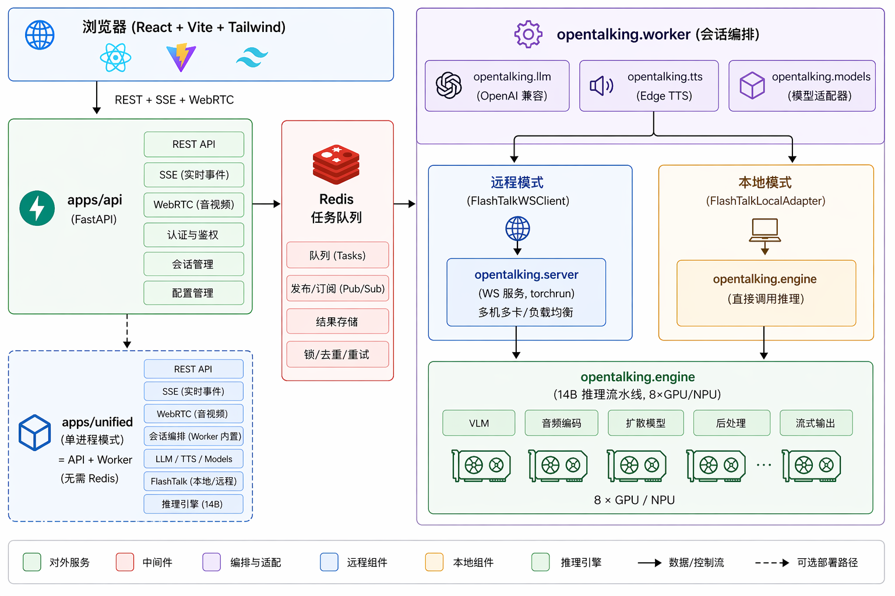
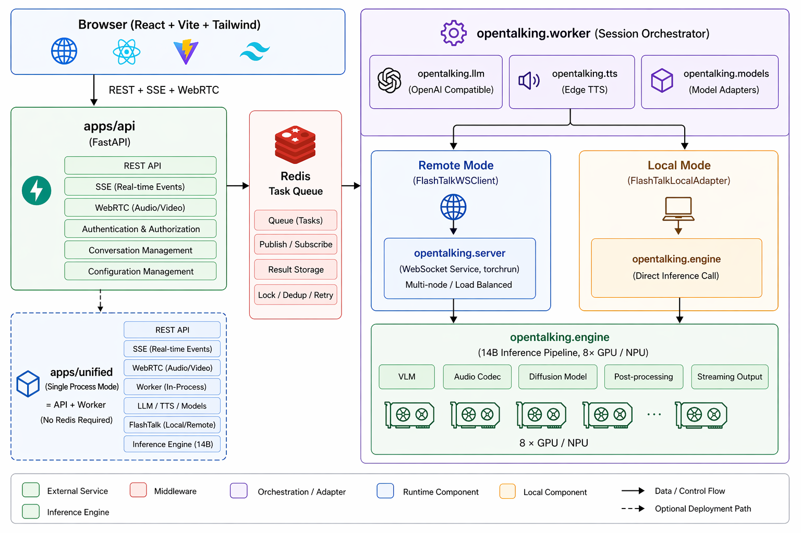

<p align="center">
  
</p>

<h1 align="center">OpenTalking</h1>

<p align="center">
  <b>实时数字人开源框架 — 从文本到逼真的说话人视频，一站式搞定</b>
</p>

<p align="center">
  <a href="LICENSE"></a>
  
  
  
</p>

<p align="center">
  <a href="#features">特性</a> |
  <a href="#architecture">架构</a> |
  <a href="#quickstart">快速开始</a> |
  <a href="#deployment">部署</a> |
  <a href="#configuration">配置</a> |
  <a href="CONTRIBUTING.md">贡献指南</a>
</p>

---

## 简介

OpenTalking 是一个统一的实时数字人框架，将 **FlashTalk 14B 说话人视频生成引擎**与**模块化编排系统**整合为一个开源项目。

给定一张参考图片和音频输入，即可生成与语音同步的逼真说话人视频，支持实时流式输出。

## Features

- **FlashTalk 14B 推理引擎** — 基于扩散模型的说话人头部视频生成，8 卡 GPU/NPU 实时推理（~1s/chunk, 33帧@25fps）
- **多模型适配** — 内置 `flashtalk`、`musetalk`、`wav2lip` 三种模型适配器，可扩展
- **LLM 对话集成** — 兼容任何 OpenAI 格式 API（OpenAI、DashScope、Ollama、vLLM、DeepSeek 等）
- **流式 TTS** — Edge TTS 流式语音合成（MP3 → PCM 实时转码）
- **WebRTC 实时传输** — 基于 aiortc 的视频/音频推送，浏览器直接播放
- **SSE 事件流** — 字幕、语音状态等事件实时推送
- **多部署模式** — CLI 工具 / 单进程 / 分布式 / Docker Compose 一键启动
- **多硬件支持** — NVIDIA CUDA + 华为昇腾 910B NPU + CPU fallback
- **空闲缓存** — 静音时预计算空闲动画（眨眼、口型锁定、交叉淡入淡出）

## Architecture

**中文架构图**



**English Architecture**



## 项目结构

```
opentalking/
├── src/opentalking/
│   ├── core/         # 配置、接口协议、类型定义、消息总线
│   ├── engine/       # FlashTalk 14B 推理引擎（自包含）
│   ├── server/       # FlashTalk 分布式 WebSocket 服务
│   ├── models/       # 模型适配器注册表（flashtalk / musetalk / wav2lip）
│   ├── worker/       # 会话编排（LLM → TTS → 推理 → WebRTC）
│   ├── llm/          # OpenAI 兼容 LLM 客户端
│   ├── tts/          # TTS 适配器（Edge TTS）
│   ├── rtc/          # WebRTC 传输层（aiortc）
│   ├── avatars/      # 头像资源加载与验证
│   └── events/       # SSE 事件系统
├── apps/
│   ├── api/          # FastAPI REST 服务
│   ├── unified/      # 单进程模式（API + Worker）
│   ├── web/          # React 前端
│   └── cli/          # CLI 工具（视频生成 / Gradio / 模型下载）
├── configs/          # YAML 配置文件
├── docker/           # Docker Compose + Dockerfile
├── scripts/          # 启动和部署脚本
├── tests/            # 单元测试 / 集成测试
└── docs/             # 文档
```

## Quickstart

### 环境要求

- Python >= 3.9
- Node.js >= 18（前端）
- Redis（分布式模式需要）
- FFmpeg（TTS 音频转码）
- CUDA >= 12.0 或 Ascend NPU（FlashTalk 推理需要）

### 1. 安装

```bash
# 克隆仓库
git clone https://github.com/anthropics/opentalking.git
cd opentalking

# 创建虚拟环境
python3 -m venv .venv
source .venv/bin/activate

# 安装基础依赖（编排层，无需 GPU）
pip install -e ".[dev]"

# 如需运行 FlashTalk 推理引擎，安装引擎依赖
pip install -e ".[engine]"

# 如需 Gradio 演示界面
pip install -e ".[demo]"
```

### 2. 下载模型

```bash
# 交互式下载（支持 HuggingFace 和 ModelScope 镜像）
python -m apps.cli.download_models

# 或使用 Shell 脚本
bash scripts/download_models.sh
```

模型清单：
| 模型 | 大小 | 用途 |
|------|------|------|
| SoulX-FlashTalk-14B | ~37GB | 说话人视频生成（4 个 safetensors 分片 + T5 + CLIP + VAE） |
| chinese-wav2vec2-base | ~400MB | 语音特征提取 |

### 3. 配置

```bash
# 复制配置模板
cp .env.example .env

# 编辑关键配置
vim .env
```

开源默认配置现在走 `demo` 路径：

- 默认隐藏 `flashtalk`，优先使用 `demo-avatar` + `wav2lip`
- 不依赖 FlashTalk 远端服务，也不要求先下载 37GB 权重
- 适合社区用户先把 API、WebRTC、TTS、前端链路完整跑通

如果你需要完整 FlashTalk，可以直接切换到下面任一模板：

```bash
# 远端 FlashTalk 服务
cp .env.remote.example .env

# 或本地单机 FlashTalk 引擎
cp .env.local.example .env
```

如需启用 LLM 对话，至少需要配置：
```bash
# LLM（任何 OpenAI 兼容端点）
OPENTALKING_LLM_BASE_URL=https://dashscope.aliyuncs.com/compatible-mode/v1
OPENTALKING_LLM_API_KEY=sk-your-key-here
OPENTALKING_LLM_MODEL=qwen-turbo
```

### 4. 启动服务

**单进程 Demo 模式**（默认，最适合开源体验和开发联调）：

```bash
bash scripts/start_unified.sh
# 或直接运行：opentalking-unified --port 8000
```

默认会优先使用 `demo-avatar` / `wav2lip` 这条轻量路径，不依赖 FlashTalk 服务。

**FlashTalk 本地模式**（单机自部署）：

```bash
cp .env.local.example .env
python -m apps.cli.download_models
bash scripts/start_unified.sh
```

**FlashTalk 远端模式**（适合生产部署或 GPU 机器分离部署）：

```bash
cp .env.remote.example .env

# 终端 1：FlashTalk 推理服务（GPU 机器）
torchrun --nproc_per_node=8 -m opentalking.server \
    --ckpt_dir ./models/SoulX-FlashTalk-14B \
    --wav2vec_dir ./models/chinese-wav2vec2-base \
    --port 8765

# 终端 2：API 服务
opentalking-api

# 终端 3：Worker
opentalking-worker
```

### 5. 启动前端

```bash
cd apps/web
npm ci
npm run dev
```

打开浏览器访问 `http://localhost:5173`。

## Deployment

### Docker Compose

```bash
# 全栈分布式部署（需 GPU 主机）
docker compose -f docker/docker-compose.yml up --build

# 单进程模式（轻量级）
docker compose -f docker/docker-compose.unified.yml up --build

# 仅 FlashTalk 推理服务
docker compose -f docker/docker-compose.flashtalk.yml up --build
```

### 昇腾 910B 部署

```bash
# 使用昇腾部署脚本
bash scripts/deploy_ascend_910b.sh

# 安装昇腾特定依赖
pip install -e ".[engine,ascend]"
```

详见 [docs/hardware.md](docs/hardware.md)。

## Configuration

所有配置通过环境变量或 `.env` 文件管理，统一前缀 `OPENTALKING_`。

### 核心配置

| 变量 | 默认值 | 说明 |
|------|--------|------|
| `OPENTALKING_FLASHTALK_MODE` | `off` | FlashTalk 模式：`remote`（远程 WS）/ `local`（本地引擎）/ `off` |
| `OPENTALKING_FLASHTALK_WS_URL` | `ws://localhost:8765` | FlashTalk WebSocket 服务地址 |
| `OPENTALKING_LLM_BASE_URL` | - | LLM API 端点（OpenAI 兼容） |
| `OPENTALKING_LLM_API_KEY` | - | LLM API 密钥 |
| `OPENTALKING_LLM_MODEL` | `qwen-turbo` | LLM 模型名称 |
| `OPENTALKING_TTS_VOICE` | `zh-CN-XiaoxiaoNeural` | TTS 语音 |
| `OPENTALKING_REDIS_URL` | `redis://localhost:6379/0` | Redis 连接地址 |
| `OPENTALKING_DEFAULT_MODEL` | `wav2lip` | 默认模型适配器 |

### FlashTalk 推理参数

| 变量 | 默认值 | 说明 |
|------|--------|------|
| `OPENTALKING_FLASHTALK_FRAME_NUM` | `33` | 每 chunk 输出帧数 |
| `OPENTALKING_FLASHTALK_SAMPLE_STEPS` | `4` | 扩散推理步数（2 = 速度优先，4 = 质量优先） |
| `OPENTALKING_FLASHTALK_HEIGHT` | `768` | 视频高度 |
| `OPENTALKING_FLASHTALK_WIDTH` | `448` | 视频宽度 |
| `OPENTALKING_FLASHTALK_JPEG_QUALITY` | `40` | JPEG 流式传输质量 |

完整配置参考 [.env.example](.env.example) 和 [docs/configuration.md](docs/configuration.md)。

## CLI 工具

```bash
# 批量生成视频（直接使用推理引擎，无需启动服务）
python -m apps.cli.generate_video \
    --ckpt_dir ./models/SoulX-FlashTalk-14B \
    --wav2vec_dir ./models/chinese-wav2vec2-base \
    --cond_image examples/avatars/flashtalk-demo/ref.jpg \
    --audio_path examples/audio/sample_16k.wav

# Gradio 演示界面
python -m apps.cli.gradio_app

# 交互式模型下载
python -m apps.cli.download_models
```

## 开发

```bash
# 代码检查
ruff check src/ apps/cli/ apps/api/ apps/unified/ tests/

# 类型检查
mypy src/opentalking/core --ignore-missing-imports

# 运行测试
pytest tests/ -v

# 前端构建
cd apps/web && npm run build
```

## 致谢

- [Alibaba Wan Team](https://github.com/Wan-Video) — Wan 视频生成基础模型
- [SoulX-FlashTalk](https://github.com/SoulX-FlashTalk) — 实时说话人视频生成
- [Edge TTS](https://github.com/rany2/edge-tts) — 微软 Edge 语音合成
- [aiortc](https://github.com/aiortc/aiortc) — Python WebRTC 实现

## License

[Apache License 2.0](LICENSE)
