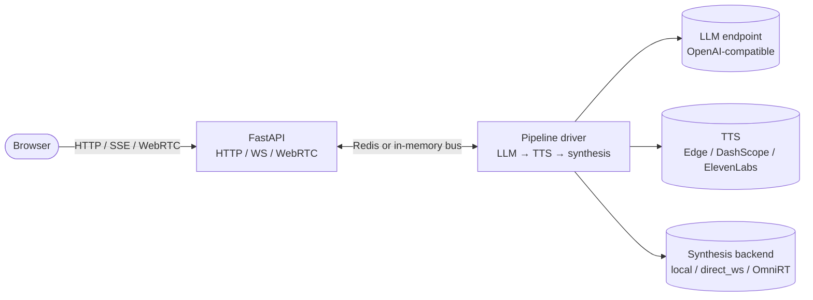

# OpenTalking

**The open-source orchestration layer for real-time digital humans.**

OpenTalking is *not* a talking-head model. It is the layer that integrates a
talking-head model with everything else a production conversational digital human
requires: streaming speech recognition, large language models, text-to-speech
synthesis, WebRTC delivery, and per-session control. Plug in the model and provider
combination that fits the deployment; the orchestration contract stays the same.

[Get started in five minutes :material-rocket-launch:](user-guide/quickstart.md){ .md-button .md-button--primary }
[Stable docs URL :material-open-in-new:](https://datascale-ai.github.io/opentalking/){ .md-button }
[View on GitHub :material-github:](https://github.com/datascale-ai/opentalking){ .md-button }

The site defaults to Chinese. English lives at <https://datascale-ai.github.io/opentalking/en/>.

---

## What OpenTalking is for

Building a digital human application that talks and listens in real time involves
roughly a dozen moving parts: speech recognition with end-pointing, a streaming
language model client, sentence-level text-to-speech synthesis, audio decoding,
talking-head rendering, WebRTC track management, barge-in handling, and session
state. OpenTalking implements all of these as a single FastAPI service, exposes a
small REST and WebSocket interface, and delegates synthesis to the configured
model backend for each session.

If the question is "I have a wav2lip checkpoint, how do I serve a real-time chat
experience on top?" — OpenTalking is the answer. If the question is "how should the
model itself run?", choose a backend: local adapter, direct WebSocket service, OmniRT,
or a mock path for tests.

## Key capabilities

<div class="grid cards" markdown>

-   :material-account-voice: **Realtime conversation pipeline**

    ASR, LLM, TTS, talking-head rendering, and WebRTC delivery in one interruptible session loop.

-   :material-puzzle: **Pluggable model backends**

    Resolve synthesis by `model + backend`: `mock`, `local`, `direct_ws`, or `omnirt`.

-   :material-api: **Unified API**

    REST, SSE, WebSocket, and WebRTC signaling are exposed through one FastAPI service.

-   :material-tune: **Replaceable providers**

    Use OpenAI-compatible LLM endpoints and switch TTS across Edge, DashScope, CosyVoice, or ElevenLabs.

-   :material-account-convert: **Avatar and voice assets**

    Manage avatar bundles, custom portraits, voice catalog entries, and cloned voices.

-   :material-server-network: **Flexible deployment**

    Run `unified`, split API/Worker, Docker Compose, or remote GPU/NPU model services.

</div>

## Pick your starting point

<div class="grid cards" markdown>

-   :material-flash: **Quickstart**

    ---

    Five-minute walkthrough from source checkout to a working end-to-end session
    using the mock synthesis path.

    [Quickstart →](user-guide/quickstart.md)

-   :material-cog: **Configuration**

    ---

    Reference for every environment variable and YAML field, with default values
    and precedence rules.

    [Configuration →](user-guide/configuration.md)

-   :material-server-network: **Deployment**

    ---

    Deployment topologies covering single-process, API/Worker split, Docker
    Compose, and Ascend 910B.

    [Deployment →](user-guide/deployment.md)

-   :material-api: **API Reference**

    ---

    Complete REST, Server-Sent Events, and WebSocket reference for all endpoints.

    [API Reference →](api-reference/index.md)

-   :material-puzzle: **Model Adapter**

    ---

    Integration guide for adding a new talking-head model to OpenTalking.

    [Model Adapter →](developer-guide/model-adapter.md)

-   :material-sitemap: **Architecture**

    ---

    System architecture, session lifecycle, and event bus reference.

    [Architecture →](developer-guide/architecture.md)

</div>

## Minimal example

```bash title="terminal"
git clone https://github.com/datascale-ai/opentalking.git
cd opentalking

python3 -m venv .venv && source .venv/bin/activate
pip install -e ".[dev]"
cp .env.example .env

# Configure OPENTALKING_LLM_API_KEY and DASHSCOPE_API_KEY in .env, then:
bash scripts/quickstart/start_all.sh --mock
```

After startup, open <http://localhost:5173>, select the `demo-avatar` and `mock`
model, and initiate a conversation. To enable real talking-head synthesis, configure
the selected model's backend, for example:

```yaml title="configs/default.yaml"
models:
  wav2lip:
    backend: omnirt
  quicktalk:
    backend: local
  flashhead:
    backend: direct_ws
```

`OMNIRT_ENDPOINT` is required only for models using `backend: omnirt`; the
client-side workflow remains unchanged.

## System architecture



The complete system view — components, deployment topologies, session lifecycle,
and event bus schema — is documented in [Architecture](developer-guide/architecture.md).

## Where OpenTalking fits

| Concern | OpenTalking | Synthesis backend | Hosted LLM | TTS provider |
|---------|:-----------:|:-----------------:|:----------:|:------------:|
| Session lifecycle and state | ✓ | | | |
| HTTP and WebSocket API | ✓ | | | |
| WebRTC signaling and tracks | ✓ | | | |
| Speech recognition (via DashScope) | ✓ | | | |
| Sentence-level streaming pipeline | ✓ | | | |
| Barge-in propagation | ✓ | | | |
| Voice catalog and cloning | ✓ | | | |
| Avatar bundle management | ✓ | | | |
| Talking-head model weights and inference | | ✓ | | |
| GPU and NPU scheduling and batching | | ✓ when backend supports it | | |
| Chat completion inference | | | ✓ | |
| Speech synthesis | | | | ✓ |

## Use cases

- **Conversational assistants** with a visual avatar for customer support, sales, or onboarding.
- **Live broadcast applications** where the avatar responds to viewer interactions in real time.
- **Educational software** that requires both speech recognition and synthesized speech feedback.
- **Internal productivity tools** that pair a corporate language model with a digital human interface.
- **Research and prototyping** for talking-head generation, where the orchestration layer is needed but not the focus of the work.

## Community and support

- **GitHub** — [datascale-ai/opentalking](https://github.com/datascale-ai/opentalking) for issues, pull requests, and discussions.
- **QQ group** — `1103327938` (AI 数字人交流群), primarily Chinese-language community.
- **Documentation** — [User Guide](user-guide/quickstart.md), [Developer Guide](developer-guide/architecture.md), [API Reference](api-reference/index.md).
- **Contributing** — see the [Contributing](developer-guide/contributing.md) guide for submission guidelines.

## License

OpenTalking is released under the Apache License, Version 2.0. Talking-head model
weights and external model services are governed by their individual licenses;
consult the respective model repositories or backend deployments for details.
