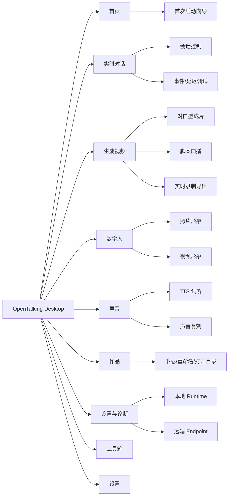
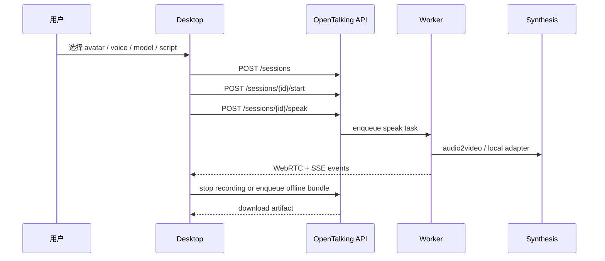
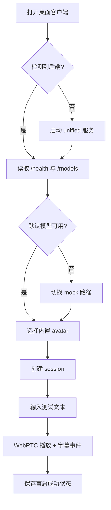
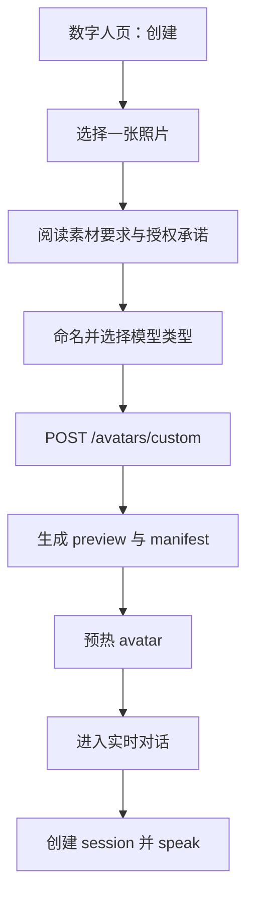
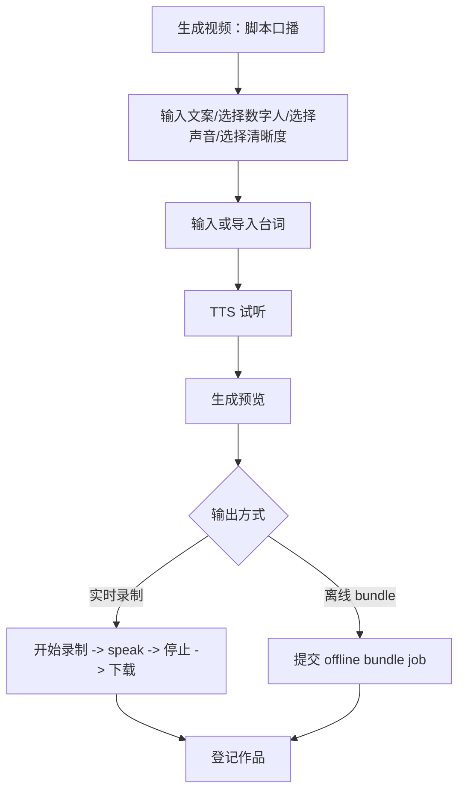
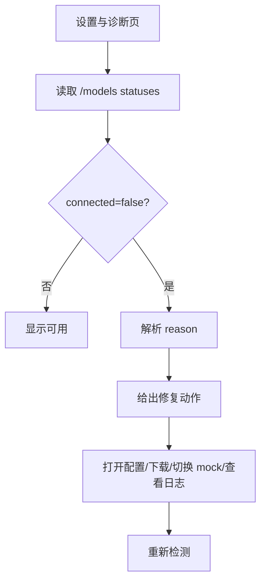
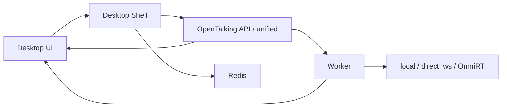

# OpenTalking 桌面客户端原型设计

> 时间：2026-06-03
> 目标：为 OpenTalking 设计一个面向真实使用者的桌面客户端原型。它不是把 WebUI 简单套壳，而是围绕实时数字人对话、离线成片、模型诊断和资产管理建立一个可长期演进的工作台。

## 1. 参考产品要点

### AIGCPanel 可借鉴点

[AIGCPanel](https://github.com/modstart-lib/aigcpanel) 的公开 README 将它定位为跨 Windows / macOS / Linux 的一站式 AI 数字人桌面应用，核心模块包括数字人合成、TTS / 语音克隆 / ASR、音视频工具箱、智能直播、模型管理、可视化工作流和命令行工具。

对 OpenTalking 桌面端有价值的不是照搬其功能数量，而是以下产品组织方式：

- **任务启动台**：第一屏只放用户最常用的任务入口、最近作品和一句可理解的运行结论；模型状态、日志和技术诊断下沉到设置/诊断页。
- **模型管理中心**：本地模型和远程 API endpoint 在同一处配置、启动、停止、查看日志。
- **数字人资产库**：形象模板、绿幕/普通素材、生成任务和导出结果形成闭环。
- **工具箱入口**：把 TTS、ASR、对口型、字幕、音频处理等高频小工具做成独立任务。
- **直播/互动能力**：对 OpenTalking 来说可转译为实时对话、客服陪伴、演示直播和弹幕/外部事件输入。
- **工作流思路**：短期不必做完整节点编排，但应预留“脚本 -> 语音 -> 数字人 -> 导出/推流”的流水线。

### 飞影数字人可借鉴点

[飞影数字人官网](https://hifly.cc/) 和 [学习中心](https://hifly.cc/study/feature/index.html) 更像云端创作平台：从数字人复刻、公共数字人、常用工具、一键成片、作品管理，到市场和积分体系，围绕“快速产出可发布视频”组织用户路径。

对 OpenTalking 桌面端有价值的是：

- **低门槛复刻流程**：照片生成数字人、短视频生成数字人、上传前要求提示、命名、提交、任务完成后去创作。
- **对口型工具流**：上传图片/视频，输入文本或上传音频，选择声音，选择是否加字幕，生成作品。
- **作品管理**：全部作品可查看、重命名、下载；生成任务状态对普通用户可见。
- **数字人市场/公共资产**：OpenTalking 可先做“本地示例库 + 社区资产入口”，不必先做交易平台。
- **创作范式**：面向口播、知识讲解、商品介绍、视频翻译、课程讲解等明确场景。

## 2. OpenTalking 桌面端定位

### 产品一句话

OpenTalking Desktop 是一个本地优先的实时数字人工作台：让用户在自己的电脑或私有服务器上配置模型、创建数字人、进行实时语音/文本对话，并把对话或脚本生成可下载的视频作品。

### 与现有 WebUI 的区别

当前 OpenTalking WebUI 已能选择/新建 avatar、配置 LLM / TTS / STT / 合成模型、查看模型连接状态，并完成实时对话、字幕和 WebRTC 播放验证。桌面客户端应在此基础上新增四层产品能力：

| 层级 | WebUI 现状 | 桌面客户端目标 |
|---|---|---|
| 启动 | 用户自行跑脚本、访问端口 | 一键启动/连接 OpenTalking，自动检查端口、环境、模型路径 |
| 资产 | 能列出 avatar / 创建自定义 avatar | 统一管理数字人、声音、参考素材、缓存、作品 |
| 任务 | 实时会话为主 | 实时会话 + 离线成片 + 录制导出 + 批量任务 |
| 诊断 | 模型 connected 状态 | 运行时日志、依赖检查、GPU/CPU 状态、错误修复建议 |

### 目标用户

| 用户 | 核心诉求 | 原型重点 |
|---|---|---|
| 开源体验者 | 不懂部署也能跑通 mock / Wav2Lip / QuickTalk | 首次向导、模型状态、诊断报告 |
| 内容创作者 | 快速做数字人口播/讲解视频 | 对口型工具、脚本成片、作品管理 |
| 私有化团队 | 在内网接 OmniRT / 本地 STT/TTS / LLM | Endpoint 管理、健康检查、日志、权限与合规 |
| 开发者 | 调 API、看事件、调低延迟链路 | 调试面板、SSE/WebRTC 状态、session 事件时间线 |

## 3. 产品信息架构



### 侧边栏建议

| 导航 | 图标语义 | 页面定位 |
|---|---|---|
| 首页 | 启动台 | 三个主任务、最近作品、简单运行结论 |
| 实时对话 | 摄像/聊天 | OpenTalking 的核心第一屏 |
| 生成视频 | 剪辑/魔法棒 | 脚本或音频驱动的离线成片 |
| 数字人 | 用户形象 | Avatar 资产库、复刻、预热 |
| 声音 | 麦克风 | TTS 试听、音色库、声音复刻 |
| 作品 | 文件夹 | 录制、离线 bundle、导出文件 |
| 设置与诊断 | 服务器/齿轮 | 本地/远端服务、日志、健康检查 |
| 工具箱 | 扳手 | ASR、TTS、对口型、字幕等小工具 |

## 4. 核心页面原型

### 4.1 首页

目的：让普通用户在 5 秒内知道“现在准备用哪个数字人和声音、下一步该点哪里、作品在哪里”。首页不再承担技术监控职责，API / Worker / Redis / `/models` 等细节默认收进“设置与诊断”。

布局：

```text
┌────────────────────────────────────────────────────────────┐
│ 顶栏：OpenTalking Desktop   可以使用   当前组合   进入对话    │
├─────────────┬──────────────────────────────┬───────────────┤
│ 侧边栏      │ 先确认数字人和声音，再开始互动                 │
│ 首页        │ 选择数字人形象 -> 选择声音 -> 开始对话/视频     │
│ 实时对话    ├──────────────────────────────┬───────────────┤
│ 生成视频    │ 最近作品                     │ 运行状态      │
│ 数字人      │ 播放 / 下载 / 打开            │ 基础功能可用  │
│ 我的作品    │                              │ 查看详细诊断  │
└─────────────┴──────────────────────────────────────────────┘
```

关键组件：

- **当前组合摘要**：顶栏、首页、实时对话页和生成视频页都同步显示当前“数字人 + 声音”，避免用户不知道自己即将使用什么形象和声音。
- **单一编号流程**：首页只保留“选择数字人形象 -> 选择声音 -> 开始对话/视频”这一条 1/2/3 流程，任务卡和状态卡不再重复编号，避免普通用户误解为多个并列流程。
- **三张主任务卡**：实时对话、生成口播视频、自定义形象和声音；每张卡只说明用户能完成什么，不暴露 API 名称，也不承担步骤说明。
- **对话前准备流**：实时对话不是第一步，必须先确认“数字人形象”和“声音”。首页可以提供默认示例组合（如“新闻主播 + 自然女声”）降低门槛，但界面要明确这两个准备项已经就绪，并允许用户更换。
- **简单运行结论**：默认只显示“基础功能可用 / 需要处理 / 正在准备”，出错时给一个明确按钮。
- **首次启动向导入口**：新用户优先引导“使用示例数字人和示例声音跑通”，再进入本地或远端模型。
- **最近作品**：展示可播放、可下载、可继续编辑的产物，而不是任务日志。
- **详细诊断入口**：高级用户可进入“设置与诊断”查看 `/health`、`/models`、日志和 endpoint 状态。

状态：

| 状态 | 显示 | 主按钮 |
|---|---|---|
| 未配置 | 后端未启动或端口不可达 | 启动本地服务 / 连接远端 |
| Mock 可用 | 基础功能可用 | 开始实时对话 |
| 本地模型缺失 | 高质量模式还没准备好 | 使用基础模式 / 去设置 |
| 远端不可达 | 远端服务未连接 | 去设置与诊断 |
| 全链路可用 | 功能已就绪 | 开始对话 / 生成视频 |

### 4.2 首次启动向导

目标：解决 OpenTalking 当前最容易劝退新用户的问题：不知道该选 mock、本地模型还是 OmniRT。

步骤：

1. **选择使用方式**
   - 快速体验：mock + Edge TTS，验证 LLM/TTS/WebRTC。
   - 本机显卡：Wav2Lip / QuickTalk / MuseTalk local。
   - 远端推理：连接 OmniRT / FlashHead / 自定义服务。

2. **环境检查**
   - 端口：API、Web、Worker、Redis。
   - 基础工具：ffmpeg、Python 环境、Node 前端仅开发模式需要。
   - GPU：CUDA / MPS / CPU 提示，不阻断 mock。
   - 权重路径：按模型显示缺失项。

3. **服务启动/连接**
   - 本地 unified：选择端口并启动。
   - Split 模式：API / Worker / Redis 分开显示。
   - 远端模式：输入 endpoint，测试 `/models` 或 OmniRT 模型列表。

4. **首个会话**
   - 选择或确认内置 avatar。
   - 选择或确认默认声音。
   - 进入实时对话，输入一句测试文本。
   - 成功后进入首页并保存配置。

### 4.3 实时对话页

这是桌面端的核心页面，但普通用户视角下应先是“对话前准备检查”，再进入“数字人舞台”。形象和声音是必备条件；实时页只展示当前选择和更换入口，不再同时提供一套重复下拉框。输入方式可直接选择文字、麦克风或二者并用；模型、STT/TTS provider、WebRTC 等技术细节默认自动选择并收进高级设置。

布局：

```text
┌────────────────────────────────────────────────────────────┐
│ 会话标题  当前形象  当前声音  录制  中断  结束会话           │
├───────────────┬──────────────────────────────┬─────────────┤
│ 当前选择      │ 中央视频舞台                 │ 右侧面板     │
│ 数字人卡片    │ 数字人视频/音频              │ 对话消息     │
│ 声音卡片      │ 字幕浮层                     │ 输入框       │
│ 输入方式      │ 麦克风音量                   │ 运行提示     │
│ 高级设置      │                              │              │
└───────────────┴──────────────────────────────┴─────────────┘
```

关键交互：

- **会话前准备锁定**：数字人和声音是必填准备项；没有准备时禁用“开始对话”，并引导去“数字人”或“声音”页面。默认示例可以视为已准备。
- **当前选择卡片**：实时对话页左侧只显示“当前数字人”和“当前声音”两张卡片，卡片按钮负责跳转更换或试听，避免“已选择清单 + 下拉框”造成重复。
- **跨页面同步当前组合**：用户在数字人页、声音页或生成视频页切换数字人/声音后，首页、实时对话页、生成视频页、顶栏和侧栏同步更新。
- **文本输入和麦克风输入并列**：文本 `speak` 用于脚本/调试，麦克风 `speak_audio` 用于实时对话。
- **中断控制**：显著放置 `/sessions/{id}/interrupt`，并显示当前 speaking / idle / queued。
- **录制控制**：对 FlashTalk 兼容模型显示录制开关，调用 `flashtalk-recording/start|stop` 并可下载。
- **事件时间线**：SSE 事件按 transcript、LLM、TTS、frame、status、error 分层，用颜色和耗时标记。
- **低延迟模式**：提供“稳定优先 / 低延迟 / 调试”三个预设，内部映射 TTS chunk、VAD、postprocess、模型参数。

页面状态：

| 状态 | 中央区域 | 右侧状态 |
|---|---|---|
| 未创建会话 | Avatar 预览 + 开始按钮 | 配置检查 |
| 初始化中 | Loading + 当前阶段 | worker_ready 等待 |
| ready | idle 视频/静帧 | 可输入 |
| speaking | 正在播放 + 字幕 | TTS / frame 事件滚动 |
| interrupted | 快速回 idle | 记录中断点 |
| error | 错误摘要 + 修复建议 | 展开原始日志 |

### 4.4 生成视频页

生成视频页借鉴飞影“一键成片”和 AIGCPanel“数字人合成/工具箱”的路径，但要贴合 OpenTalking 的当前能力：优先做口播、对口型、实时会话录制和 FlashTalk offline bundle。普通用户主流程按“文案 -> 数字人 -> 声音 -> 清晰度 -> 生成”组织，模型选择默认由系统处理。页面中的 Tab 必须对应不同任务表单，不能只是切换高亮但内容不变。

#### Tab A：脚本口播

输入：

- 数字人：选择内置/自定义 avatar。
- 台词：手动输入、导入 txt、从历史对话生成。
- 声音：选择 voice，支持试听。
- 字幕：不开启 / 内嵌字幕 / 导出 srt。
- 输出：实时预览、录制导出、离线 bundle。

普通用户表单顺序：

1. 输入文案。
2. 选择数字人。
3. 选择声音。
4. 选择清晰度或导出方式。

高级用户可在设置与诊断中查看驱动模型：mock / wav2lip / quicktalk / musetalk / flashtalk 等，以及每个模型的连接状态。

流程：



#### Tab B：对口型工具

输入：

- 素材：图片或视频。当前可优先对接 `/avatars/custom` 的图片 avatar 和已有 avatar preview；视频 avatar 作为后续扩展。
- 台词来源：文本、音频上传、麦克风录音。
- 声音：TTS voice 或保留原音频。
- 模型：Wav2Lip / QuickTalk / MuseTalk / FlashTalk，按素材兼容性过滤。
- 字幕：是否生成字幕。

输出：

- 生成中显示阶段：上传 -> TTS/音频处理 -> avatar 预热 -> 合成 -> 导出。
- 完成后进入作品详情，可下载 video / audio / zip。
- 原型中该 Tab 显示“上传素材 -> 台词或音频 -> 输出方式 -> 生成对口型视频”，与口播视频表单区分开。

#### Tab C：实时录制成片

适合演示、客服话术、课程讲解：

- 开始实时会话。
- 打开录制。
- 用户文本/语音驱动数字人。
- 停止录制。
- 自动进入作品库。
- 原型中该 Tab 不重复生成表单，而是显示当前组合和“进入实时对话并录制”入口。

#### Tab D：批量任务（MVP 后）

- 多段台词逐条生成。
- 多声音对比。
- 多 avatar 对比。
- 失败任务可重试。

### 4.5 数字人页

目标：把 OpenTalking 的 avatar 概念做成普通用户能理解的“数字人资产库”。

布局：

```text
┌────────────────────────────────────────────────────────────┐
│ 数字人  + 创建数字人  搜索  类型过滤                         │
├────────────────────────────────────────────────────────────┤
│ 卡片网格：预览图/视频、名称、适合场景、是否自定义、状态      │
│ 操作：设为当前、去对话、查看进度、编辑、去修复、查看详情    │
└────────────────────────────────────────────────────────────┘
```

创建数字人流程：

1. 确认素材：
   - 普通用户只需看到“照片是否清晰、是否授权、是否适合生成数字人”。
   - 一张照片：走 `POST /avatars/custom`，生成自定义 avatar。
   - 一段视频：先作为产品原型预留，后端需补充视频 avatar 导入/预处理。

2. 上传并命名：
   - 图片：正脸/半身、无遮挡、清晰、尺寸限制。
   - 名称要用于后续下拉选择和作品参数复用。

3. 选择用途：
   - 实时对话、口播视频、高质量视频或私有化部署。
   - 系统内部再匹配 model_type 和资产要求，不在普通流程里先暴露模型名。

4. 预热：
   - 调 `/avatars/{avatar_id}/prewarm`。
   - 普通用户只显示“准备中 / 可使用 / 需要修复”；face cache、QuickTalk template、Wav2Lip preload 等阶段放到诊断详情里。

资产按钮规则：

- 可使用：显示“设为当前”和“去对话”。
- 准备中：显示“查看进度”和“编辑”。
- 不可用：显示“去修复”和“查看详情”，不直接提供“设为当前”。

创建弹窗原则：

- 第一屏先给上传区域，不先暴露模型参数。
- 表单只保留“照片、名称、用途、授权确认”四件事。
- 生成方式、预计时间和完成后状态用摘要说明，降低用户对技术配置的负担。

### 4.6 声音页

目标：统一声音选择、试听、声音复刻、本地 CosyVoice 和云端 TTS。普通用户先回答“用哪个声音”，再决定是否复刻；provider、model、key 检查放到高级检查或设置与诊断。

模块：

- **声音库**：默认展示“可用 / 我的声音 / 本地声音”，内部调用 `GET /voices`。
- **TTS 试听**：调用 `POST /tts/preview`，普通页只暴露试听文本、播放和保存。
- **声音复刻**：调用 `POST /voices/clone`，普通页显示录音素材、授权确认和结果状态。
- **参考音频检查**：时长、音量、识别文本一致性，放进“高级检查”折叠区。
- **删除与重命名**：删除已复刻声音；重命名需要新增 API 或本地 metadata。

交互重点：

- provider 切换时自动过滤不可用 voice，但普通页不先暴露 provider。
- API key 缺失时不让用户盲试，直接跳到设置与诊断页对应配置。
- 本地 CosyVoice 的 prompt.wav / prompt.txt 放在“本地资产位置”中可打开。
- 可用声音统一提供“试听”和“设为当前”，选中后同步到首页、实时对话和生成视频。

### 4.7 作品页

目标：补齐飞影式“作品管理”，让生成结果不散落在临时目录。

作品类型：

| 类型 | 来源 | 当前 API/能力 |
|---|---|---|
| 实时录制 | flashtalk recording | `/sessions/{id}/flashtalk-recording` |
| 离线 bundle | flashtalk offline bundle | `/sessions/{id}/flashtalk-offline-bundle` |
| TTS 音频 | TTS preview / script export | 需要桌面端保存本地文件 |
| ASR 结果 | transcribe | 需要作品化封装 |
| 对口型视频 | 生成视频任务 | 由任务产物统一登记 |

作品卡片：

- 缩略图或波形。
- 名称、类型、创建时间、耗时、模型、avatar、voice。
- 状态：queued / running / failed / done。
- 操作：播放、下载、重命名、打开目录、复制参数、重新生成、删除。
- 顶部提供“全部 / 视频 / 音频 / 字幕”筛选和作品搜索；视频作品优先给“播放、继续编辑、下载”。

桌面端本地数据建议：

- 使用 SQLite 保存作品索引。
- 文件存在用户目录，例如 `~/OpenTalking/works/`。
- 作品参数保存为 JSON，方便复现。

### 4.8 设置与诊断页

这是桌面客户端区别于云端平台的关键页面。

普通用户入口只显示结论：基础功能可用、高质量模式准备中、远端服务未连接。进入设置与诊断后，默认仍先展示“基础体验 / 本地高质量 / 远端高质量 / 声音服务”四类能力状态；mock、wav2lip、quicktalk、flashtalk、flashhead、端口、日志和 endpoint 信息放进“高级详情”。

分区：

1. **OpenTalking 后端**
   - 本地 unified：启动/停止、端口、日志。
   - 远端 API：base URL、连接测试、CORS 提示。
   - Split 模式：API / Worker / Redis 状态。

2. **LLM**
   - OpenAI-compatible base URL、model、API key。
   - 测试：发送短 prompt，返回耗时和错误。

3. **STT**
   - DashScope Paraformer realtime。
   - SenseVoiceSmall local。
   - key / 权重 / CPU 可用性提示。

4. **TTS**
   - Edge、DashScope Qwen、CosyVoice service、local_cosyvoice、ElevenLabs。
   - 试听和 provider key 检查。

5. **Talking-head**
   - mock、wav2lip、musetalk、quicktalk、fasterliveportrait、flashtalk、flashhead。
   - backend：mock / local / direct_ws / omnirt。
   - 对每个模型显示：connected、reason、endpoint、推荐硬件、文档入口。

6. **日志与诊断**
   - API log、worker log、OmniRT reachability、Redis queue。
   - 一键复制诊断报告，用于 GitHub issue。

### 4.9 工具箱

MVP 工具箱不追求 25+ 工具，而是围绕 OpenTalking 当前链路做“少而强”的工具：

工具页分为“常用工具”和“排查工具”。常用工具放文本转语音、语音转字幕、生成对口型；排查工具只在用户遇到问题时进入设置与诊断。工具按钮必须指向明确结果，例如“打开声音试听”“打开对口型表单”，不使用含糊的“去生成”。

| 工具 | 输入 | 输出 | 对接能力 |
|---|---|---|---|
| TTS 文本转语音 | 文本、voice、provider | wav/mp3 | `/tts/preview` + 本地保存 |
| ASR 语音转文字 | wav/mp3 | 文本/字幕 | `/sessions/{id}/transcribe` 或独立封装 |
| 对口型 | 图片/视频 + 文本/音频 | mp4 | 生成视频任务 |
| 录音测试 | 麦克风 | 波形、识别文本 | STT provider |
| 模型连通测试 | endpoint | 状态报告 | `/models` / `/health` |
| 字幕导出 | 对话事件/ASR | srt/vtt | SSE 事件与 ASR 结果 |

## 5. 核心流程原型

### 5.1 新用户跑通 mock



### 5.2 创建照片数字人并实时对话



### 5.3 脚本生成口播视频



### 5.4 模型诊断修复



## 6. API 与能力映射

### 已可直接对接

| 桌面功能 | 后端接口 |
|---|---|
| 健康检查 | `GET /healthz`、`GET /health`、`GET /runtime/status`、`GET /queue/status` |
| 模型状态 | `GET /models` |
| 数字人列表 | `GET /avatars` |
| 创建图片数字人 | `POST /avatars/custom` |
| avatar 预览 | `GET /avatars/{id}/preview`、`GET /avatars/{id}/preview-video` |
| avatar 预热 | `POST /avatars/{id}/prewarm` |
| 删除自定义 avatar | `DELETE /avatars/{id}` |
| 创建会话 | `POST /sessions` |
| 启动会话 | `POST /sessions/{id}/start` |
| 文本驱动说话 | `POST /sessions/{id}/speak` |
| 音频驱动说话 | `POST /sessions/{id}/speak_audio`、`POST /sessions/{id}/speak_flashtalk_audio` |
| 中断 | `POST /sessions/{id}/interrupt` |
| WebRTC offer | `POST /sessions/{id}/webrtc/offer` |
| SSE 事件 | `GET /sessions/{id}/events` |
| FlashTalk 录制 | `POST /sessions/{id}/flashtalk-recording/start|stop`、`GET /sessions/{id}/flashtalk-recording` |
| 离线 bundle | `POST /sessions/{id}/flashtalk-offline-bundle`、状态与下载接口 |
| TTS 试听 | `POST /tts/preview` |
| 声音库 | `GET /voices` |
| 声音复刻 | `POST /voices/clone` |

### 需要新增或产品化封装

| 需求 | 建议 |
|---|---|
| 统一作品库 | 新增桌面端 SQLite 索引；后端可后续提供 `/works` |
| 任务中心 | 桌面端先聚合已有 job/session；后端后续统一 job schema |
| 视频 avatar 导入 | 新增 `/avatars/custom-video` 或扩展 `/avatars/custom` |
| 字幕导出 | 桌面端基于 SSE/ASR 生成 srt；后端可提供 transcript artifact |
| 模型下载/安装 | 桌面端调用脚本或包管理器；后端提供 doctor JSON 更稳 |
| 配置写入 | 桌面端维护 profiles；谨慎直接写 `.env`，需备份 |
| 权限/授权承诺 | 创建 avatar/voice 前加入本地确认记录 |

## 7. 视觉与交互风格

### 设计原则

- **工作台感**：比营销页更克制，信息密度适中，强调状态、任务和可执行动作。
- **视频舞台优先**：实时对话页中央区域优先给数字人画面，配置与调试收在两侧。
- **状态可解释**：所有 connected=false、API key missing、runtime missing 都要带下一步动作。
- **桌面原生感**：支持窗口拖拽、菜单栏、托盘、快捷键、打开本地目录。
- **资产可回溯**：每个作品能看到 avatar、voice、model、prompt、输出文件。

### 色彩建议

- 主色：OpenTalking 可使用偏科技的蓝绿色，但避免整页单一蓝/紫渐变。
- 背景：浅色模式以 `#F6F8FA`、`#FFFFFF`、`#E5E7EB` 为基底。
- 状态色：成功绿、警告琥珀、错误红、运行蓝。
- 视频区：使用深色舞台，避免浅色 UI 干扰画面。

### 组件规范

- 顶栏：连接状态、当前数字人 + 声音组合、进入实时对话、设置。
- 侧边栏：图标 + 文本，宽度 220px，可折叠。
- 页面标题区：标题、说明、主操作按钮。
- 卡片：只用于资产/作品/状态项，半径不超过 8px。
- 表格：设置与诊断、任务列表用表格，便于扫描。
- 折叠区：高级设置、参考音频检查、模型细节默认折叠。
- 抽屉：日志、事件详情、作品参数。
- Modal：创建数字人、声音复刻、删除确认、授权承诺。
- Toast：任务提交、连接失败、下载完成。

## 8. 桌面技术方案建议

### 首选：Tauri + React

理由：

- OpenTalking Web 前端已经是 React/Vite，复用成本低。
- Tauri 包体比 Electron 小，适合开源工具。
- Rust sidecar 可管理本地 OpenTalking 进程、端口、日志、文件路径。
- 对 macOS / Windows / Linux 都可覆盖。

建议结构：

```text
apps/desktop/
├── package.json
├── src/                  # React UI，可复用 apps/web 的组件和 lib
├── src-tauri/
│   ├── tauri.conf.json
│   └── src/main.rs       # 进程管理、日志、文件系统、托盘
└── README.md
```

### 备选：Electron + React

如果团队更熟悉 Node 生态，Electron 也可行，优势是进程管理、文件系统、自动更新、日志处理更直接。缺点是包体和资源占用更高。

### 进程模型



桌面端运行模式：

| 模式 | 描述 | 适用 |
|---|---|---|
| 连接远端 | 桌面端只连已有 OpenTalking API | 私有化/服务器部署 |
| 本地 unified | 桌面端启动 `opentalking-unified` | 新手和单机 demo |
| 本地 split | 桌面端管理 API、Worker、Redis | 开发者/生产预演 |
| 外部命令 | 用户自定义启动脚本 | 高级用户 |

## 9. MVP 分期

### P0：可用桌面壳 + 实时对话

目标：替代“手动启动服务 + 打开浏览器”的体验。

- Tauri/Electron 桌面壳。
- 后端连接配置和健康检查。
- 设置与诊断页。
- 数字人列表和选择。
- 实时对话页：先确认数字人和声音，再文本 speak、WebRTC 播放、SSE 字幕/状态、中断。
- TTS 试听。
- 基础日志查看。

### P1：数字人/声音/作品闭环

- 创建图片数字人。
- avatar 预热和预览视频。
- 声音库、声音复刻。
- 实时录制下载。
- 本地作品库 SQLite。
- 作品重命名、下载、打开目录、复制参数。
- 首次启动向导。

### P2：生成视频与诊断增强

- 脚本口播成片。
- FlashTalk offline bundle 任务 UI。
- 对口型工具。
- ASR 工具和字幕导出。
- 模型诊断报告。
- 本地/远端 profile 管理。

### P3：平台化能力

- 批量任务。
- 简化工作流：脚本 -> TTS -> 数字人 -> 字幕 -> 导出。
- 直播/外部事件输入。
- 社区 avatar/voice 资产入口。
- 自动更新与插件化工具。

## 10. 原型验收清单

P0 原型可用性验收：

- 用户打开客户端后 3 秒内看到后端连接状态。
- 用户能在首页直接看到当前数字人和声音组合。
- mock 路径下，用户不读文档也能完成一次数字人说话。
- 任何模型不可用都能看到 reason 和下一步动作。
- 实时对话页能显示视频、字幕、事件和中断按钮。
- API / Worker / 模型日志可一键复制。

P1 原型可用性验收：

- 用户能上传一张图片创建自定义数字人。
- 用户能试听声音并完成一次声音复刻。
- 用户切换数字人或声音后，首页、实时对话、生成视频页同步显示当前组合。
- 用户能把一次实时会话录制成作品并下载。
- 作品详情能复现当时使用的 avatar、voice、model、prompt。

P2 原型可用性验收：

- 用户能输入一段脚本生成口播视频。
- 用户能看到离线任务进度和失败原因。
- 用户能导出字幕或 ASR 文本。
- 诊断报告足够用于提交 GitHub issue。

## 11. 推荐第一版线框页面清单

设计工具中建议先画这 12 张：

1. 首页 - 后端未启动。
2. 首页 - 全链路可用。
3. 首次启动向导 - 选择使用方式。
4. 首次启动向导 - 环境检查。
5. 实时对话 - 未创建会话。
6. 实时对话 - speaking + 事件时间线。
7. 生成视频 - 脚本口播。
8. 生成视频 - 对口型。
9. 数字人 - 资产库。
10. 数字人 - 创建照片数字人弹窗。
11. 声音 - TTS 试听/声音复刻。
12. 设置与诊断 - connected=false 诊断。

## 12. 实施优先级建议

第一版不要先追求 AIGCPanel 那种完整工具箱，也不要先做飞影式市场和积分。OpenTalking 的差异化在“开源、本地/私有化、实时对话编排、模型链路可诊断”。因此建议第一阶段聚焦：

1. 桌面端启动和连接体验。
2. 实时对话体验。
3. 数字人/声音当前组合的清晰可见。
4. 录制导出和作品库。
5. 面向失败的诊断与修复建议。

等这条链路稳定后，再扩展对口型、批量成片、字幕、工作流和直播互动。这样桌面客户端不会变成“功能很多但核心链路不稳”的工具，而会成为 OpenTalking 面向普通用户和私有化团队的真正入口。
