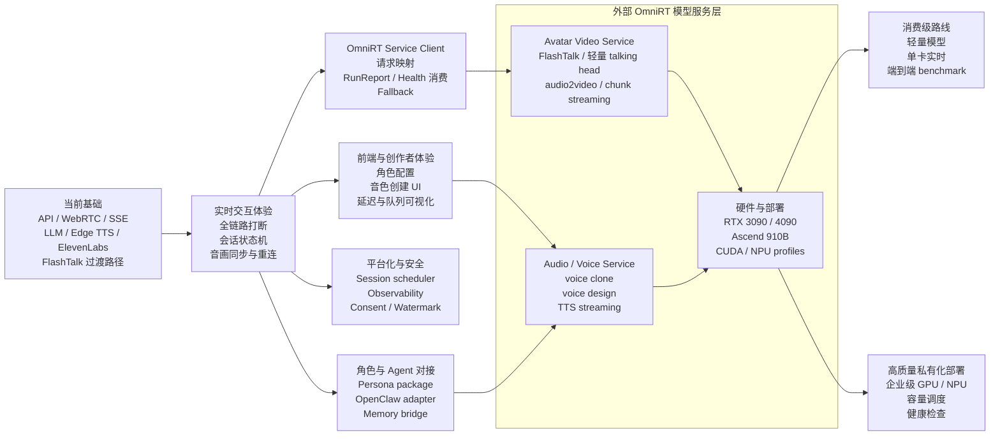

# 实时数字人研究与路线

!!! abstract "TL;DR"
    2026-04-27 的行业调研：商用/开源 talking-head 方案的竞品对比、功能矩阵、技术演进建议。核心结论是把模型部署统一委托给外部仓 [datascale-ai/omnirt](https://github.com/datascale-ai/omnirt)；本仓 OpenTalking 专注实时编排、前端、会话运行态、LLM/Agent 接入、voice profile 管理。

!!! note "归档说明"
    本文是某个时点的调研快照。具体方案在持续演进，看代码和 [架构](architecture.md) 是最新依据。

> 调研日期：2026-04-27  
> 目标：为 OpenTalking README 和项目路线图提供竞品分析、功能矩阵和技术演进建议。  
> 核心约束：未来模型部署统一调用外部仓 [datascale-ai/omnirt](https://github.com/datascale-ai/omnirt) 作为推理服务，类似 vLLM-Omni 一类模型服务化底座；本仓 OpenTalking 只负责实时数字人编排、前端、会话运行态、LLM/Agent 接入、voice profile 管理，以及与 OmniRT 的服务级集成。

## 1. Executive Summary

实时数字人开源生态已经从早期的“单图生成说话视频”逐步演进到“实时对话式 Avatar Agent”。目前热门项目大致可以分成四类：

1. **实时交互框架**：把 ASR、LLM、TTS、数字人渲染、WebRTC/RTMP 传输串成完整链路，例如 LiveTalking、OpenAvatarChat、Fay。
2. **音频驱动渲染模型**：聚焦唇形同步、头部动画、表情或图像生成，例如 MuseTalk、Wav2Lip、Ultralight-Digital-Human、SadTalker。
3. **数字人资产生产工具**：面向角色克隆、声音克隆、图片/视频资产制作，例如 Duix Avatar / HeyGem 一类项目。
4. **商用实时 Avatar API**：提供 persona、replica、knowledge base、WebRTC/API、企业安全能力，例如 Tavus、D-ID、HeyGen、bitHuman。

OpenTalking 当前已经具备实时数字人的基础骨架：LLM 对话、流式 TTS、WebRTC 推流、SSE 事件、模型服务调用、FlashTalk 推理服务、单进程/分布式/Docker 部署，以及初版打断能力。下一阶段不宜把外部 OmniRT 的建设项混入本仓 roadmap，也不需要在本仓维护大量模型 adapter，而应明确分成两条线：

- **OpenTalking 本仓**：实时交互产品层，负责会话、前端、WebRTC、voice profile、LLM、打断、OpenClaw/外部 Agent 对接、UI 临时会话状态，以及调用 OmniRT 的 service client。
- **OmniRT 外部仓**：统一推理运行时，负责模型 registry、CUDA/Ascend backend、FlashTalk resident worker、voice clone / voice design / TTS 模型服务适配、benchmark、队列、遥测和模型推理服务。

OpenTalking 的技术叙事可以写成：

```text
实时链路稳定
  -> 对接 OmniRT 外部推理服务
  -> 消费级 GPU 可用
  -> 高质量私有化部署
  -> 打断 / 角色 / OpenClaw Agent 与 memory 对接
  -> 多并发、可观测、可运营的平台化能力
```

建议 README 的核心定位更新为：

> OpenTalking 是一个面向实时交互的数字人框架，通过外部 OmniRT 推理运行时接入 FlashTalk 和轻量 avatar 模型，提供低延迟、可打断、可自定义角色、可对接 OpenClaw Agent 与其 memory 能力的 AI Avatar 体验。

## 2. Industry Landscape

### 2.1 实时交互框架

这类项目最接近 OpenTalking 的竞争范围。它们的共同目标不是单纯生成一段视频，而是完成“用户输入 -> 智能响应 -> 语音合成 -> 头像渲染 -> 实时播放”的闭环。

| 项目 | 类型 | 代表能力 | 对 OpenTalking 的启发 |
| --- | --- | --- | --- |
| [LiveTalking](https://github.com/lipku/LiveTalking) | 实时数字人框架 | WebRTC/RTMP，ASR/LLM/TTS，多渲染模型接入，支持直播/交互式场景 | 直接竞品。OpenTalking 需要突出 OmniRT、FlashTalk、Ascend 910B 和工程化部署差异 |
| [OpenAvatarChat](https://github.com/HumanAIGC-Engineering/OpenAvatarChat) | 模块化 Avatar Chat | ASR、LLM、TTS、avatar renderer 解耦，强调低延迟、模块可插拔和本地部署 | 架构表达值得对标。OpenTalking 应强调统一编排层与统一推理层的边界 |
| [Fay](https://github.com/xszyou/Fay) | 数字人助理 / Agent | 语音对话、LLM、情绪、动作、直播/客服/助理场景 | 产品能力值得借鉴：角色人格、记忆、动作、直播控制、外部工具 |
| [TalkingHead](https://github.com/met4citizen/TalkingHead) | Web 3D 头像 | 浏览器端 3D talking head、口型、表情 | 可作为轻量 Web Avatar 或 fallback 模式参考 |

这类竞品的关键特征是“全链路实时”。单点模型质量重要，但最终体验更依赖端到端延迟、打断、音视频同步、稳定推流和故障恢复。

### 2.2 音频驱动渲染模型

这类项目是 OpenTalking 模型适配层的来源。它们通常不是完整产品，但决定视觉质量、延迟、显存占用和硬件门槛。

| 项目 | 类型 | 代表能力 | 适合放在 OpenTalking 中的位置 |
| --- | --- | --- | --- |
| [MuseTalk](https://github.com/TMElyralab/MuseTalk) | 实时/近实时唇形模型 | 音频驱动人物口型，社区集成度高 | 轻量实时模型 baseline，适合消费级 GPU 路线 |
| [Wav2Lip](https://github.com/Rudrabha/Wav2Lip) | 经典唇形同步模型 | 泛化强、生态成熟、接入成本低 | Demo / fallback / 低门槛开源体验 |
| [Ultralight-Digital-Human](https://github.com/anliyuan/Ultralight-Digital-Human) | 轻量数字人模型 | 强调低资源、轻量实时 | 3090/4090 单卡友好路线参考 |
| [SadTalker](https://github.com/OpenTalker/SadTalker) | 单图 talking head | 从图片和音频生成说话视频 | 更适合离线内容生产，不应作为实时主链路 |
| [SoulX-FlashTalk / FlashTalk 系列] | 高质量视频生成模型 | 更高质量的说话人视频生成，适合专业级推理 | OpenTalking 当前核心模型能力，应通过 OmniRT 标准化 |

模型层的路线建议是分层，而不是“一种模型包打天下”：

- **轻量实时层**：Wav2Lip、MuseTalk、Ultralight-Digital-Human，用于开源 demo、单卡体验和低延迟场景。
- **高质量生成层**：FlashTalk，用于高质量数字人表现。
- **未来扩展层**：表情、动作、全身、3D avatar、语音驱动 blendshape。

### 2.3 数字人资产生产工具

实时数字人不只需要推理服务，也需要角色资产生产链路。Duix Avatar / HeyGem 这类项目说明，用户非常关心“我怎样创建自己的数字人”。

常见资产生产能力包括：

- 上传图片或短视频创建 avatar。
- 角色声音克隆或选择音色。
- 预处理人脸区域、口型区域、背景、idle frame。
- 生成角色配置包，包含头像、音色、prompt、知识库、风格和安全策略。
- 本地化部署，避免敏感人物素材上传第三方服务。

OpenTalking 当前已经有 `avatars` 资源加载和校验、模型适配器 `load_avatar`、idle frame 机制。后续可以把 avatar 从“素材目录”升级为“角色包”：

```text
avatar package
  - visual assets
  - voice profile / external voice id
  - persona prompt
  - external agent namespace
  - external knowledge base reference
  - safety / consent metadata
  - runtime profile
```

### 2.4 商用实时 Avatar API

商用平台的能力不一定开源，但代表产品体验终局。值得观察的方向包括：

| 平台 | 方向 | 值得借鉴的能力 |
| --- | --- | --- |
| [Tavus](https://www.tavus.io/) | Conversational video / replica | persona、replica、实时视频对话、API-first |
| [D-ID](https://www.d-id.com/) | Agents / streaming avatar | WebRTC streaming、知识问答、角色化 agent |
| [HeyGen](https://www.heygen.com/) | Avatar / interactive avatar | 数字人克隆、多语言、视频生产和交互式 avatar |
| [bitHuman](https://www.bithuman.ai/) | Realtime avatar | 低延迟 avatar animation、商用 API |

商用平台的共性是：它们不会把“模型名称”放在第一卖点，而是强调 persona、knowledge、conversation、latency、API、security。OpenTalking README 也应减少单点模型堆砌，增加“可构建什么产品”的表达。

## 3. Feature Matrix

### 3.1 行业常见能力

| 能力 | 行业成熟度 | OpenTalking 当前状态 | 建议 |
| --- | --- | --- | --- |
| OpenAI 兼容 LLM | 高 | 已支持 | 保持 provider 无关，补充流式取消和工具调用 |
| 流式 TTS / Voice 服务 | 高 | 已支持 Edge TTS、ElevenLabs TTS 过渡路径 | 不在本仓训练或适配声音模型；voice clone / voice design / TTS 合成优先由 OmniRT 服务适配，本仓只管理 voice profile 和调用 |
| WebRTC 实时输出 | 高 | 已支持 aiortc | 继续优化音画同步、重连、拥塞策略 |
| SSE 字幕/状态事件 | 中高 | 已支持 | 扩展为统一 observability event |
| 模型服务接入 | 高 | 已有 flashtalk / musetalk / wav2lip 历史 adapter 设计和 FlashTalk WS 过渡路径 | 未来主要对接外部 OmniRT 服务，本仓只保留 service client、请求映射和 fallback |
| 远端推理服务 | 高 | 已支持 FlashTalk WebSocket server | 新增 OmniRT service client，逐步替代本仓自带 FlashTalk WS 服务 |
| 单进程 demo | 高 | 已支持 | 保持低门槛体验 |
| 分布式部署 | 中高 | 已支持 API / worker / server / Redis | 增加调度、健康检查和多 worker 管理 |
| Docker 部署 | 高 | 已支持 | 增加 CUDA / Ascend 镜像矩阵 |
| 昇腾 910B | 中 | 文档和脚本已有入口；OmniRT 外部仓已有 Ascend/910B FlashTalk resident benchmark | 本仓只做部署对接、配置透传、健康检查消费和 README 说明 |
| 打断 | 高 | 初版支持，TTS 迭代中检测 interrupt | 需要升级为全链路取消：LLM、TTS、video frame queue、WebRTC buffer |
| 记忆 | 中高 | 规划中 | 不在本仓自研 memory；优先对接 OpenClaw/外部 Agent 自带 memory，本仓仅保留 UI 临时会话状态和上下文透传 |
| 自定义角色 | 高 | 基础 avatar 资源机制已具备 | 升级为 persona package |
| 情绪 / 动作控制 | 中 | 规划中 | 先从 prompt 和 TTS style 开始，再扩展 renderer 控制信号 |
| 工具调用 / Agent | 中高 | 规划中 | 不在本仓重做复杂 Agent，优先提供 OpenClaw/外部 Agent adapter |
| 多并发调度 | 中高 | 基础分布式形态已有 | 需要 session scheduler、runtime capacity model |
| 可观测性 | 中高 | 基础事件已有 | 增加延迟、FPS、队列深度、drop frames、GPU/NPU 指标 |
| 安全合规 | 中 | 规划中 | 增加 consent、watermark、敏感角色保护 |

### 3.2 OpenTalking 应形成的差异化

OpenTalking 与 LiveTalking、OpenAvatarChat 等项目的差异化不应只靠“我们也支持实时数字人”。建议明确三张牌：

1. **OmniRT-integrated inference**  
   模型推理统一调用外部 OmniRT 服务，使 OpenTalking 专注于会话编排、实时传输和产品能力。本仓 roadmap 只跟踪 service client、请求映射、配置和服务编排，不跟踪 OmniRT 内部后端建设。

2. **Consumer-to-production hardware path**  
   同一套框架既可以在 RTX 3090 / 4090 上做开发体验，也能在昇腾 910B 上做私有化生产部署。

3. **Agent-ready digital human**  
   数字人不只是“说话的视频”，而是具备角色、打断能力，并能对接 OpenClaw 或外部 Agent runtime；Agent memory 由外部 Agent 侧维护。

## 4. Proposed Technical Evolution

### 4.1 分层架构建议

建议 README 中把 OpenTalking 描述为四层：

```text
Application Layer
  Web console, API, sessions, persona management, knowledge, memory

Orchestration Layer
  ASR / LLM / OmniRT audio service / interrupt / event bus / scheduling / WebRTC

Inference Runtime Layer
  OpenTalking OmniRT service client, request mapping, streaming/chunk bridge

Model and Hardware Layer
  External OmniRT service, FlashTalk, MuseTalk, Wav2Lip, future avatar models
  CUDA GPUs, Ascend 910B, CPU fallback
```

这套表达比“src 目录介绍”更适合 README，因为用户能快速理解项目边界：OpenTalking 不是单个模型，而是实时数字人系统框架。

### 4.2 OpenTalking 与 OmniRT 的边界

OmniRT 是外部仓，不属于 OpenTalking 本仓构建范围。本仓不应把 “实现 OmniRT backend”“新增 OmniRT 模型 registry”“OmniRT benchmark 框架” 写进 roadmap；这些属于 OmniRT 仓的工作。

OpenTalking 本仓只需要做：

1. **OmniRT service client**  
   在 OpenTalking 内新增一个推理服务客户端，把当前会话推理请求转成 OmniRT 的 `audio2video` 或后续 chunk API。不要为每个模型在本仓写一套深度 adapter。

2. **请求和产物映射**  
   把 OpenTalking 的 avatar、audio chunk、session id、runtime profile 映射到 OmniRT `GenerateRequest` / `GenerateResult` / `RunReport`，再把 OmniRT 输出转成 WebRTC 帧或视频 chunk。

3. **服务编排**  
   支持配置外部 OmniRT endpoint、健康检查、超时、重试、容量读取、错误事件转换。

4. **平滑迁移**  
   保留当前 FlashTalk WebSocket / local mode 作为过渡路径，同时新增 `omnirt` 推理模式。等 OmniRT 集成稳定后，再逐步把默认生产路径切到 OmniRT service。

5. **消费指标**  
   OpenTalking 不负责生成 OmniRT benchmark，但需要消费 OmniRT 的 `RunReport`、queue depth、worker health、timings，把它们展示到前端和日志中。

### 4.3 OmniRT 外部仓现状与协同需求

以下状态基于 2026-04-27 对 [datascale-ai/omnirt](https://github.com/datascale-ai/omnirt) 主分支的浅克隆检查。该部分是跨仓协同清单，不属于 OpenTalking 本仓 roadmap。

| 能力 | OmniRT 当前状态 | 证据/位置 | OpenTalking 需要做什么 |
| --- | --- | --- | --- |
| 统一请求契约 | [x] 已有 | `GenerateRequest` / `GenerateResult` / `RunReport`，支持 `text2image`、`image2image`、`text2video`、`image2video`、`audio2video` | 本仓实现请求映射和结果解析 |
| Python API / CLI / Server | [x] 已有 | `omnirt.api.generate`、`omnirt generate`、`omnirt serve`、FastAPI routes | 本仓优先配置 OmniRT endpoint；Python client 只作为本地开发选项 |
| Backend 抽象 | [x] 已有 | `backends/cuda.py`、`backends/ascend.py`、`backends/cpu_stub.py` | 本仓不要重复实现 backend，只读取能力和错误 |
| Ascend / 910B 环境说明 | [x] 已有 | quickstart 中包含 Ascend / 910 / 910B、CANN、torch_npu、`ASCEND_RT_VISIBLE_DEVICES` | 本仓 README 链接到 OmniRT 文档，保留 OpenTalking 编排配置 |
| `audio2video` 任务面 | [x] 已有 | docs index 写明 `audio2video` 示例模型 `soulx-flashtalk-14b` | 本仓把数字人推理请求转到该任务面 |
| `soulx-flashtalk-14b` registry | [x] 已有 | `models/flashtalk/pipeline.py` 注册 `soulx-flashtalk-14b`，task 为 `audio2video`，默认 backend 为 `ascend` | 本仓模型选项中新增 OmniRT FlashTalk target |
| FlashTalk persistent worker | [x] 已有 | `models/flashtalk/resident_worker.py`，支持 queue、rank0 协调、gRPC resident proxy | 本仓对接 worker health / queue depth，不再自建同类 worker |
| FlashTalk 910B benchmark | [x] 已有 | `docs/developer_guide/flashtalk_resident_benchmark.md`：Ascend 910B2 x8，热态 `steady_chunk_core_ms_avg ≈ 891ms`，`steady_chunk_total_ms_avg ≈ 954ms` | 本仓引用该数据作为外部推理基线，但不要标成本仓已完成 |
| gRPC worker / controller | [x] 已有 | `engine/grpc_transport.py`、`workers/managed.py`、`workers/remote.py` | 本仓决定走 HTTP/FastAPI 还是 gRPC client |
| Queue / batching / dispatch | [x] 已有基础 | `dispatch/queue.py`、`batcher.py`、`policies.py` | 本仓 session scheduler 读取 OmniRT 容量，不重复队列调度 |
| Telemetry / Prometheus / OTel | [x] 已有 | `telemetry/prometheus.py`、`telemetry/otel.py`、`RunReport.timings` | 本仓把指标映射到 SSE/前端/日志 |
| Voice clone / voice design / TTS 服务 | [ ] 需协同 | 当前报告未在 OmniRT 主分支确认到统一 voice service task 面 | 建议在 OmniRT 仓增加 `text2audio` / `voice_clone` / `voice_design` 或统一 audio generation API；OpenTalking 只传 `voice_profile` 和接收 PCM/audio artifact |
| 消费级轻量 avatar 模型 | [ ] 需协同 | 当前可见重点是 FlashTalk，未看到 MuseTalk/Wav2Lip/Ultralight 作为 OmniRT 内建模型 | 如果要统一走 OmniRT，需要在 OmniRT 仓新增这些模型服务；OpenTalking 只维护模型选择和调用入口 |
| 实时 chunk streaming API | [~] 需确认/增强 | 当前 `audio2video` 主要产物是 MP4/Artifact；FlashTalk resident 有 chunk 指标，但 OpenTalking WebRTC 需要逐 chunk 帧流 | 需要跨仓定义 streaming/chunk response；本仓先支持 MP4/文件模式或保留旧 WS 过渡 |
| 远端服务容量协议 | [~] 已有基础 | gRPC health 有 worker id、queue depth 等；Prometheus 指标存在 | 本仓需要明确读取字段和降级策略 |

需要注意：我尝试在本机用 `PYTHONPATH=/tmp/omnirt-inspect/src pytest` 跑 OmniRT 的 FlashTalk 相关单元测试，但当前机器缺少 `google.protobuf`，且本机 NumPy wheel 架构不匹配，测试未能收集成功。因此上表主要基于源码、文档、测试文件和 benchmark 文档检查，而不是本机完整测试通过。

### 4.4 OmniRT 实时对话产线模型适配 Roadmap

这部分是给 OmniRT 仓使用的模型服务适配计划，不属于 OpenTalking 本仓 roadmap。目标是把实时数字人对话链路里的模型都服务化，形成类似 `vLLM-Omni` 的统一模型服务层：OpenTalking 调用服务，不在本仓维护模型 runtime。

#### 4.4.1 产线总链路

```text
用户麦克风 / 文本输入
  -> VAD / Turn Detection
  -> ASR
  -> LLM / Agent
  -> TTS / Voice
  -> Avatar Video
  -> WebRTC 音视频输出
```

最小实时路径可以先从 `text -> TTS -> Avatar Video` 做起；完整语音对话再补 `VAD -> ASR -> Agent`。

#### 4.4.2 OmniRT 任务面建议

| 环节 | OmniRT task 面 | 输入 | 输出 | 优先级 | 说明 |
| --- | --- | --- | --- | --- | --- |
| VAD / Turn Detection | `audio_activity` | microphone PCM stream | speech segments / endpoint events | P1 | 决定什么时候把用户语音送 ASR，直接影响打断体验 |
| ASR | `speech2text` / `streaming_asr` | PCM chunks | partial/final text + timestamps | P1 | 语音输入必备，优先做低延迟流式 |
| Agent / LLM | `chat` / OpenAI-compatible proxy | text + context | streaming text / tool calls | P2 | 可先继续由 OpenTalking/OpenClaw 调外部 LLM；OmniRT 可后续统一代理 |
| TTS | `text2audio` / `streaming_tts` | text + `voice_profile_id` | PCM chunks / audio artifact | P0 | 数字人说话最核心，必须支持流式首包 |
| Voice Clone | `voice_clone` | reference audio + metadata | `voice_id` / voice embedding | P1 | 支持用户上传音色 |
| Voice Design | `voice_design` | natural-language voice prompt | candidate voices / `voice_id` | P2 | 支持自然语言描述音色，先接可用 provider |
| Avatar Video | `audio2video` / `streaming_audio2video` | audio chunks + avatar | video frames / chunks / RunReport | P0 | 当前 FlashTalk 已有基础，下一步补实时 chunk API |
| Emotion / Action | `text2motion_control` / optional | text/audio/emotion hint | emotion/action tags | P3 | 非首要，可先通过 Agent response protocol 传结构化字段 |
| Quality / Safety | `audio_safety` / `avatar_safety` | audio/image/voice metadata | risk labels | P3 | 合规、授权音色、敏感角色保护 |

#### 4.4.3 分阶段适配计划

**M0：打通最小可用链路**

- [x] `audio2video`: `soulx-flashtalk-14b` 已在 OmniRT registry 中出现。
- [ ] `streaming_tts`: `text + voice_profile_id -> PCM chunks`。
- [ ] `streaming_audio2video`: `PCM chunks + avatar -> video frames/chunks`。
- [ ] 统一 `RunReport` 字段：首包延迟、chunk latency、FPS、队列深度、错误码。

**M1：支持自定义音色**

- [ ] `voice_clone`: 上传参考音频生成 `voice_id`。
- [ ] `voice_design`: 自然语言描述生成候选音色。
- [ ] `voice_profile` 与 OmniRT provider/backend 解耦：OpenTalking 只保存 profile，OmniRT 决定具体后端。
- [ ] 音色合规字段：consent、source、creator、用途、过期策略。

**M2：支持语音输入实时对话**

- [ ] `audio_activity`: VAD、端点检测、用户插话检测。
- [ ] `streaming_asr`: partial transcript、final transcript、timestamps。
- [ ] 打断联动：用户语音开始时通知 OpenTalking 取消当前 TTS/avatar 队列。
- [ ] ASR 与 Agent 的上下文协议：把 final transcript 交给 OpenClaw/LLM。

**M3：消费级显卡模型服务**

- [ ] 轻量 avatar backend：MuseTalk / Wav2Lip / Ultralight-Digital-Human / SoulX-FlashHead 候选。
- [ ] 3090 / 4090 runtime profile：分辨率、chunk size、精度、显存预算。
- [ ] 降级策略：高质量模型不可用时回退到轻量 talking-head 或 3D avatar。
- [ ] 端到端 benchmark：TTS 首包、avatar 首帧、steady FPS、A/V drift。

**M4：生产部署与多并发**

- [ ] 910B FlashTalk production profile。
- [ ] Worker health / capacity：每个模型服务上报并发、队列、显存/NPU 使用。
- [ ] 多模型路由：voice service、avatar service、ASR service 独立扩缩容。
- [ ] Prometheus / OTel 指标标准化。

#### 4.4.4 候选模型/服务

| 环节 | 优先候选 | 备选 | 备注 |
| --- | --- | --- | --- |
| VAD | Silero VAD / WebRTC VAD | FSMN-VAD | 轻量、低延迟，适合先做服务化 |
| ASR | SenseVoice / FunASR Paraformer Streaming | VibeVoice-ASR / faster-whisper / Whisper large-v3 | 中文实时优先可看 SenseVoice/FunASR；VibeVoice-ASR 更适合长音频结构化转写，是否满足实时 partial 需要单独评测 |
| TTS | VibeVoice-Realtime-0.5B / Fish Audio S2 / CosyVoice | F5-TTS / GPT-SoVITS / ElevenLabs provider | 实时优先看首包延迟、流式稳定性和音质；VibeVoice-Realtime 当前偏英文单说话人，中文和生产许可需实测/核对 |
| Long-form TTS | VibeVoice long-form TTS | Fish Audio S2 / IndexTTS2 | 适合播客、长配音、非严格实时生成；不是实时对话首选路径 |
| Voice Clone | CosyVoice / GPT-SoVITS / F5-TTS / Fish Speech | ElevenLabs / IndexTTS2 | 开源方案多依赖参考音频；VibeVoice 不作为默认 voice clone 路线，除非后续官方可用分支明确支持并满足许可 |
| Voice Design | ElevenLabs Voice Design / Fish Audio S2 instruction control | 可控 TTS / prompt-based voice provider | 纯自然语言“生成新音色”开源路线仍需实测；Fish S2 更偏文本内指令控制表达 |
| Avatar Video | FlashTalk / SoulX-FlashHead | MuseTalk / Wav2Lip / Ultralight-Digital-Human | FlashTalk 质量优先，轻量模型负责消费级实时 |
| Agent / LLM | OpenClaw + OpenAI-compatible LLM | vLLM / Ollama / DeepSeek / Qwen | Agent memory 和工具调用不建议放 OpenTalking core |

#### 4.4.5 Voice/TTS 候选模型更新策略

语音模型迭代很快，OmniRT 侧不要把候选列表写死，也不要只按 GitHub stars 做选型。建议每次适配前按以下口径重新确认：

- **官方仓和权重是否可用**：优先看 GitHub / Hugging Face / ModelScope 官方入口，避免只看第三方复刻。
- **是否支持流式首包**：实时数字人优先 `time-to-first-audio`，其次才是长文本质量。
- **是否支持 voice profile**：至少要支持 preset voice 或 reference audio；自然语言 voice design 可作为增强项。
- **中文质量与跨语言**：中文普通话、英文、混说、情绪、数字/专名读法都要单独测。
- **部署成本**：3090/4090 能否跑，是否需要 H100/H200/910B，是否支持批量和并发。
- **安全与许可**：声音克隆必须核对授权、watermark、使用限制和商用条款。
- **产线实测优先**：最终进入 OmniRT 默认后端前，必须跑同一套 benchmark：`tts_first_pcm_ms`、RTF、显存/内存、稳定 10 分钟生成、音色相似度、中文 MOS、A/V drift、并发队列退化。

截至 2026-04-28，值得重点跟进：

| 模型/服务 | 适合环节 | 当前判断 |
| --- | --- | --- |
| VibeVoice-Realtime-0.5B | `streaming_tts` | 微软官方定位实时流式 TTS，模型卡标注约 300ms 首音频、0.5B、支持 streaming text input；当前偏英文单说话人，官方也提示研究/开发用途，适合作为 OmniRT 实时 TTS P0 评测对象，但不能直接写成生产默认 |
| VibeVoice-ASR | long-form ASR / structured transcript | 微软官方支持 60 分钟单次输入、说话人/时间戳/内容结构化输出，适合会议/播客/长上下文 ASR；实时 partial 能力需单独确认，不建议直接替代流式 ASR |
| VibeVoice long-form TTS | long-form TTS / podcast / multi-speaker audio | 适合长配音和多说话人内容生产；官方曾因滥用风险移除部分 TTS 代码，适配前必须复核当前可用权重、代码、许可、水印和用途限制 |
| Fish Audio S2 | `streaming_tts` / expressive control | 2026 新开源，强调低延迟、表达控制、多说话人，适合和 VibeVoice-Realtime 并列评测；商业使用需核对 license |
| CosyVoice / CosyVoice 2/3 | `streaming_tts` / `voice_clone` | 中文、本地化、zero-shot voice clone 友好，适合私有化路线 |
| IndexTTS2 | `voice_clone` / 可控配音 | 情绪、时长控制、中文/英文配音值得评测，偏内容生产和精确控制 |
| GPT-SoVITS / F5-TTS | `voice_clone` | 开源生态成熟，适合参考音频克隆和本地服务化 baseline |

#### 4.4.6 实时指标口径

| 指标 | 目标含义 |
| --- | --- |
| `asr_partial_latency_ms` | 用户说话到 partial transcript 的延迟 |
| `llm_first_token_ms` | Agent/LLM 首 token 延迟 |
| `tts_first_pcm_ms` | 文本到第一段 PCM 的延迟 |
| `avatar_first_frame_ms` | PCM 到第一帧视频的延迟 |
| `steady_chunk_ms` | 稳态每 chunk 推理耗时 |
| `end_to_end_first_response_ms` | 用户结束一句话到数字人开始回应 |
| `av_drift_ms` | 音频和视频帧同步偏移 |
| `queue_depth` | 模型服务排队压力 |

### 4.5 消费级 GPU 路线

消费级路线的目标是让开发者在 RTX 3090 / 4090 上跑通完整体验。重点不是极致画质，而是稳定、低门槛、低延迟。

建议目标：

- 4090 单卡：完整实时 demo，支持轻量模型和可选高质量模型。
- 3090 单卡：提供 memory-optimized profile，默认更小分辨率、更短 chunk、更低精度或量化。
- 自动 profile：根据显存选择模型、分辨率、chunk size、batch size。
- 提供开源默认路径：无需下载 37GB 权重也能跑通 API、WebRTC、TTS、avatar。

### 4.6 高质量私有化部署路线

专业级路线的目标是私有化部署、高质量生成和多并发。这里的 README 表达应更偏工程可落地，而不是“理论支持”。对观众侧不建议把标题写成“昇腾 910B 部署”，而应写成“高质量私有化部署”：核心价值是企业内网、私有数据、可控推理服务和高质量数字人表现；昇腾 910B、H100/H200、A800/H800 等企业级 GPU/NPU 是实现路径。

建议目标：

- OpenTalking 配置外部 OmniRT Ascend 服务地址。
- 读取 OmniRT worker health、queue depth、RunReport timings。
- 将 OmniRT FlashTalk 910B benchmark 引用到 OpenTalking README，而不是在本仓重复维护推理 benchmark。
- API / worker / external OmniRT inference service 解耦部署。
- 在 OpenTalking 层实现 session scheduler，根据外部 OmniRT 容量做路由。

### 4.7 Agent 化能力路线

实时数字人的下一阶段是从“视频生成器”变成“可交互角色”。建议分三步做：

1. **Persona package**  
   自定义角色配置：头像、声音、system prompt、说话风格、欢迎语、背景信息。

2. **Agent memory bridge**  
   OpenTalking 不自研 short-term / long-term memory。记忆、用户画像、任务状态、RAG/知识库优先由 OpenClaw 或外部 Agent runtime 维护；OpenTalking 只负责把用户输入、角色配置、会话 id、当前 avatar 状态透传给 Agent，并接收 Agent 的文本和结构化控制信号。

3. **Action and emotion control**  
   在 LLM 输出中携带结构化控制信号，例如 emotion、gesture、speaking style、scene event。初期可以只影响 TTS style 和字幕事件，后续扩展到 renderer。

## 5. Roadmap 分类

下面的 roadmap 不再按严格串行 Phase 表达，而按可以并行推进的能力域来组织。这样更贴近 OpenTalking 的实际演进：实时链路、外部 OmniRT 对接、消费级模型、910B 生产部署、OpenClaw/Agent 对接、前端产品化可以同步推进，只是在里程碑发布时做组合交付。

### Roadmap 总览图



状态说明：

- `[x]` 已完成或已有基础版本。
- `[~]` 已有雏形，但需要增强。
- `[ ]` 规划中。

### 面向观众的 Roadmap 简版

这版适合放在 README 或项目首页，重点讲“用户能期待什么”，不展开底层工程细节。

```md
## Roadmap

- [x] 实时数字人基础体验  
  Web 控制台、LLM 对话、TTS、字幕事件、WebRTC 音视频播放。

- [~] 更自然的实时对话  
  支持打断、会话状态、低延迟响应、音画同步和异常恢复。

- [ ] OmniRT 模型服务接入  
  通过 OmniRT 统一调用 FlashTalk、轻量 talking-head、语音合成和音色服务。

- [ ] 消费级显卡可用  
  面向 RTX 3090 / 4090 提供轻量模型、单卡实时配置和端到端 benchmark。

- [~] 高质量私有化部署  
  面向企业私有化场景，支持外部 OmniRT 推理服务、容量调度、健康检查和生产监控；昇腾 910B 等企业级 GPU/NPU 路线已在构建中。

- [ ] 自定义角色和音色  
  支持角色配置、内置音色选择、上传参考音频、自然语言描述音色，并通过 OmniRT 生成语音。

- [ ] Agent 与记忆能力  
  对接 OpenClaw 或外部 Agent，复用其 memory、工具调用和知识库能力。

- [ ] 生产级平台能力  
  多会话调度、观测指标、安全合规、授权音色、合成内容标识。
```

### A. 实时数字人基础链路

目标：先把“文本输入到实时数字人说话”的链路做到稳定、可演示、可调试。

- [x] FastAPI 会话 API：创建 session、查询状态、关闭 session。
- [x] WebRTC offer API：浏览器直接拉取实时音视频。
- [x] React 前端控制台：选择 avatar、启动会话、发送文本、播放视频。
- [x] WebRTC 音视频推流：基于 aiortc 输出视频帧和 PCM 音频。
- [x] SSE 事件流：字幕、speech started、speech ended 等状态事件。
- [x] Edge TTS 流式合成：MP3 流实时解码为 PCM chunk。
- [x] ElevenLabs TTS 适配器：支持低延迟商用 TTS 路径。
- [x] OpenAI-compatible LLM 客户端：兼容 OpenAI、DashScope、DeepSeek、Ollama、vLLM 等 OpenAI 格式接口。
- [x] 单进程 unified 模式：适合本地 demo 和开发联调。
- [x] 分布式模式：API、worker、Redis、远端推理服务解耦。
- [x] Docker Compose 部署入口。
- [x] idle frame 循环：非说话状态下保持 WebRTC 视频轨持续输出。

### B. 实时交互体验

目标：把“能说话”推进到“像实时对话”。这部分可以和 OmniRT、模型适配并行。

- [~] 当前说话轮次打断：TTS streaming 中已检测 interrupt。
- [ ] 全链路打断：取消 LLM 生成、TTS 合成、FlashTalk/模型推理、WebRTC pending frame/audio queue。
- [ ] 会话状态机：用显式状态描述 session 当前处于创建、加载、就绪、思考、合成语音、生成视频、说话、打断、失败或关闭阶段，便于前端 UI、打断和错误恢复。
- [ ] 音画同步指标：audio queue delay、video queue delay、dropped frames、AV drift。
- [ ] 重连恢复：WebRTC 断开后恢复 session 或重建 session。
- [ ] 低延迟策略：LLM first token、TTS first audio、first video frame、端到端首响延迟监控。
- [ ] 句子级 streaming 策略：短句合并、尾音淡出、静音补齐、打断后的快速恢复。

### C. OmniRT 服务接入（OpenTalking 本仓）

目标：未来模型推理调用外部 OmniRT 服务；OpenTalking 本仓只做服务调用、请求映射、错误处理和指标消费，不为每个模型维护复杂 adapter。

- [ ] 新增 `OPENTALKING_INFERENCE_PROVIDER=omnirt` 模式。
- [ ] 实现 OmniRT service client：优先支持外部 OmniRT HTTP/FastAPI endpoint，Python client 仅用于本地开发。
- [ ] 将 OpenTalking session/avatar/audio 请求映射到 OmniRT `audio2video` 请求。
- [ ] 支持 `soulx-flashtalk-14b` 作为外部 OmniRT model target。
- [ ] 解析 OmniRT `GenerateResult` / `RunReport`，转换成本仓事件、日志和前端指标。
- [ ] 读取 OmniRT worker health / queue depth / capacity，用于 OpenTalking session scheduler。
- [ ] 支持超时、重试、fallback：OmniRT 不可用时回退到本仓 demo renderer 或旧 FlashTalk WS。
- [ ] 逐步把当前 FlashTalk local/remote mode 迁移为兼容层，而不是新增本仓推理 runtime 或模型 adapter。
- [ ] 如果 OmniRT 暂无 realtime chunk streaming API，则本仓保留现有 WebSocket/逐帧路径作为过渡。

### D. 消费级显卡实时路线

目标：RTX 3090 / 4090 这类消费级卡上跑完整实时体验。这里不能只依赖 FlashTalk 14B，大概率需要轻量模型或降级 profile 做实时主链路。

- [ ] 4090 单卡 realtime profile：优先保证可交互首响和稳定 FPS。
- [ ] 3090 memory-optimized profile：降低分辨率、缩短 chunk、减少缓存、启用 FP16/BF16/量化。
- [ ] 轻量模型默认路径：首次体验不要求下载 37GB FlashTalk 权重。
- [ ] 模型服务自动选择：读取 OmniRT 或本地 demo renderer 的可用模型清单，按目标 FPS、硬件和延迟选择 FlashTalk / MuseTalk / Wav2Lip / 轻量 renderer。
- [ ] OpenTalking 端到端消费级 benchmark：3090、4090 上分别测试首响延迟、FPS、显存、音画同步和稳定性。
- [ ] 开发者模式：CPU/低端 GPU 也能跑通 API、前端、TTS、WebRTC，只是渲染质量降级。

#### 消费级卡候选模型

| 模型/路线 | 实时潜力 | 优点 | 风险/限制 | 建议定位 |
| --- | --- | --- | --- | --- |
| [Wav2Lip](https://github.com/Rudrabha/Wav2Lip) | 高 | 成熟、轻量、接入成本低、适合 demo fallback | 画质、头部运动和真实感有限 | 最低门槛实时 baseline |
| [MuseTalk](https://github.com/TMElyralab/MuseTalk) | 高 | 官方定位实时高质量唇形，社区已有大量集成 | 主要处理嘴部区域，整体动作和长时稳定性需要工程补齐 | 3090/4090 主力候选 |
| [Ultralight-Digital-Human](https://github.com/anliyuan/Ultralight-Digital-Human) | 高 | 强调轻量、低资源、实时，适合消费级或边缘设备 | 需要评估画质、训练/资产流程和协议适配 | 轻量实时 profile 候选 |
| [GeneFace++](https://github.com/yerfor/GeneFacePlusPlus) | 中高 | NeRF-based，项目页披露 RTX3090 可达实时级别，3D 一致性好 | 通常偏 person-specific，需要训练/资产准备 | 高质量个人数字人候选 |
| [TalkingHead](https://github.com/met4citizen/TalkingHead) / 3D Avatar | 很高 | 浏览器/3D avatar 路线延迟低、资源小、交互稳定 | 真实感弱于视频生成模型 | 低成本交互 fallback 或产品化 3D 模式 |
| [SoulX-FlashHead](https://github.com/Soul-AILab/SoulX-FlashHead) | 待验证 | SoulX 官方称面向消费级 GPU 实时 talking head | 需要进一步验证代码、权重、许可证和适配成本 | 重点跟进的消费级高质量路线 |
| FlashTalk 14B 降级 profile | 中 | 质量潜力最高，和当前核心模型一致 | 原始路线偏 8xH800，单卡消费级实时压力大 | 4090 实验路线，不作为首个消费级默认 |

消费级路线建议采用“三层 fallback”：

1. **开源快速体验**：Wav2Lip / TalkingHead / demo renderer。
2. **单卡实时主力**：MuseTalk / Ultralight-Digital-Human / GeneFace++。
3. **高质量实验路线**：SoulX-FlashHead / FlashTalk 小模型或量化 profile。

### E. 高质量私有化部署路线

目标：服务企业私有化、高质量生成、多并发和国产化硬件部署。它和消费级路线不是先后关系，而是另一条并行硬件线。对外标题使用“高质量私有化部署”，在介绍中说明昇腾 910B 等企业级 GPU/NPU 路线已在构建中。

- [~] Ascend 910B 部署文档和脚本入口。
- [ ] OpenTalking 配置外部 OmniRT Ascend 服务地址、模型 id、超时和认证。
- [ ] 消费 OmniRT health / queue depth / RunReport timings。
- [ ] 基于外部 OmniRT capacity 的 session scheduler。
- [ ] README 引用 OmniRT FlashTalk 910B benchmark，并明确数据来自 OmniRT 外部仓。
- [ ] Docker Compose / 部署文档中增加 `opentalking + external omnirt` 拓扑。
- [ ] 保留旧 FlashTalk WS 部署说明作为过渡路径。

### F. 角色和 Agent 对接

目标：Agent 侧保持简单，不在 OpenTalking 内重做复杂智能体框架，也不自研 short-term / long-term memory。OpenTalking 只维护“数字人会话运行态”和 UI 临时状态；复杂 Agent 能力和 memory 优先对接 OpenClaw 或其他已有 agent runtime。

- [~] Avatar 资源加载和校验。
- [ ] Persona package：avatar、voice profile、system prompt、style、runtime profile。
- [ ] OpenClaw agent adapter：把用户输入、session id、persona id、avatar 状态转给 OpenClaw，接收文本/结构化动作，再交给 TTS 和 renderer。
- [ ] OpenClaw memory bridge：使用 OpenClaw 自带 memory，本仓仅传递必要上下文和 memory namespace。
- [ ] Conversation context passthrough：把当前用户输入、角色配置、会话元数据透传给 Agent，不在本仓沉淀长期记忆。
- [ ] UI chat history / transient session state：仅用于前端展示、刷新恢复和当前会话状态，不称为 memory 系统。
- [ ] Agent response protocol：`text`、`emotion`、`action`、`metadata`，先轻量定义，不强依赖复杂 planner。
- [ ] RAG/知识库作为 OpenClaw/外部 Agent 能力，不作为 OpenTalking core 的硬依赖。
- [ ] 自定义角色：声音、prompt、欢迎语、说话风格、默认动作。

### G. 音色和语音生成服务

目标：支持用户在前端直接选择内置音色，也支持“上传一个音色”或“用自然语言描述音色”来生成数字人的 audio。OpenTalking 可以内置一组 preset voice library、角色默认音色和前端选择体验，但不训练、不托管、不微调声音模型，也不在本仓适配 CosyVoice / GPT-SoVITS / F5-TTS 等模型。声音克隆、声音设计和 TTS 合成都优先由 OmniRT 作为统一 audio/voice 模型服务适配；本仓只保存 voice profile、上传元数据、consent 信息和 OmniRT 返回的 voice/audio 结果。

#### 输入方式

| 用户输入 | 推荐实现 | OpenTalking 负责 | 外部服务负责 |
| --- | --- | --- | --- |
| 选择内置音色 | Built-in preset voice library | 前端音色列表、试听、默认音色、角色绑定、provider/backend 映射 | OmniRT 或当前 TTS provider 根据 preset voice id 合成 |
| 上传参考音频 | Zero-shot / few-shot voice cloning | 上传、鉴权、同意书/consent、音频质检、保存 `voice_profile` | OmniRT voice service 从参考音频生成 `voice_id` 或直接合成语音 |
| 自然语言描述音色 | Voice design / text-to-voice | 保存描述、调用 OmniRT voice design task、展示候选音色 | OmniRT voice service 根据描述生成候选声音并返回 `voice_id` |
| 选择已有音色 | Voice library / preset voices | 音色列表、角色绑定、默认 voice 设置 | OmniRT 或其后端 provider 提供 voice id 和 TTS 合成 |
| 临时会话音色 | Ephemeral voice profile | 当前 session 绑定，不长期保存 | OmniRT 按临时 voice token 合成 |

#### Voice Profile 建议结构

```yaml
voice_profile:
  id: "voice_xxx"
  provider: "omnirt"
  backend: "edge-tts | elevenlabs | cosyvoice | gpt-sovits | f5-tts | dashscope | custom"
  mode: "builtin_preset | provider_preset | uploaded_reference | natural_language_design | external_voice_id"
  display_name: "温柔女声"
  preview_audio_uri: "optional preview uri"
  external_voice_id: "omnirt-or-provider-specific-id"
  reference_audio_uri: "optional object storage uri"
  description: "optional natural-language voice prompt"
  language: "zh-CN"
  consent:
    required: true
    status: "pending | approved | rejected"
  runtime:
    streaming: true
    sample_rate: 16000
    chunk_ms: 20
```

#### 推荐路线

- [x] Edge TTS：作为当前开源默认/低门槛 fallback。
- [x] ElevenLabs TTS：当前已有低延迟 TTS 过渡路径。
- [ ] 内置音色库：先提供 6-12 个前端可选 preset，覆盖中文女声、中文男声、英文女声、英文男声、活泼、沉稳等常用角色。
- [ ] 音色试听与角色绑定：用户在角色配置页选择音色、试听样音、保存为角色默认 voice。
- [ ] Voice profile API：创建、绑定、删除、切换音色。
- [ ] 上传参考音频：做格式校验、时长限制、响度归一、采样率转换、consent metadata。
- [ ] OmniRT voice clone task：`reference_audio + text? + config -> voice_id | audio`。
- [ ] OmniRT voice design task：`natural_language_voice_prompt -> candidate voices`。
- [ ] OmniRT TTS task：`text + voice_profile_id -> PCM chunks | audio artifact`。
- [ ] 本地开源 TTS 可由 OmniRT 适配：VibeVoice-Realtime、Fish Audio S2、CosyVoice、GPT-SoVITS、F5-TTS 等不放进 OpenTalking core。
- [ ] TTS streaming contract：统一 `text + voice_profile_id -> PCM chunks`，让下游 avatar renderer 不关心具体 OmniRT 后端。
- [ ] 安全合规：上传音色必须记录授权、用途、创建者、来源；高风险角色需要限制或水印。

#### 可考虑的外部 TTS/Voice 服务

| 服务/模型 | 上传音频克隆 | 自然语言描述音色 | 部署形态 | 在架构中的位置 |
| --- | --- | --- | --- | --- |
| VibeVoice-Realtime-0.5B | 不是默认克隆路线，当前更偏实时 TTS | 不作为 voice design 主路径 | OmniRT 本地/服务化 | `streaming_tts` P0 评测候选，重点测首包、英文/中文、单说话人限制和许可 |
| Fish Audio S2 | 支持 custom voices 路线，需按官方能力实测 | 支持文本内表达/情绪指令控制 | 本地/服务化/云 API | `streaming_tts` 与表达控制候选，重点测中文、延迟和商用许可 |
| ElevenLabs | 支持 Instant / Professional Voice Clone | 支持 Voice Design / Text to Voice | 云 API | OmniRT 可封装为 provider，OpenTalking 不直连为主路径 |
| CosyVoice | 支持短参考音频 zero-shot voice cloning | Instruct/style 能力需按版本评估 | 本地/服务化 | OmniRT 本地 voice backend 候选 |
| GPT-SoVITS | 支持 zero-shot / few-shot | 主要依赖参考音频，不是纯文字设计音色 | 本地/服务化 | OmniRT 本地 voice clone backend 候选 |
| F5-TTS | 支持 zero-shot voice cloning | 主要依赖参考音频 | 本地/服务化 | OmniRT 本地 TTS backend 候选 |
| 商用云 TTS | 视供应商而定 | 视供应商而定 | 云 API | OmniRT 可统一封装 provider 和鉴权 |

### H. 前端和创作者体验

目标：让用户不仅能跑 demo，还能创建、调试和展示自己的数字人。

- [x] 基础 Web 控制台。
- [x] 聊天消息和字幕展示。
- [~] Avatar / model 选择。
- [ ] 角色配置 UI：prompt、voice、avatar、模型 profile。
- [ ] 音色创建 UI：上传参考音频、填写自然语言音色描述、试听候选音色、绑定角色。
- [ ] Agent 状态查看 UI：展示外部 Agent / OpenClaw 返回的摘要、工具状态或 memory 引用，不直接管理本仓 memory。
- [ ] 延迟和队列状态可视化。
- [ ] Avatar asset 检查器：manifest、分辨率、fps、sample rate、预处理状态。
- [ ] Demo presets：客服、直播助理、陪练、课程讲解。

### I. 平台化和安全合规

目标：从 demo 框架走向可运维、可私有化、可商用的系统。

- [ ] 多 session scheduler。
- [ ] 队列深度、FPS、dropped frames、GPU/NPU 指标。
- [ ] Prometheus / OpenTelemetry。
- [ ] Tenant isolation 和 API key。
- [ ] Kubernetes manifests。
- [ ] Watermarking / synthetic media disclosure。
- [ ] Avatar consent metadata。
- [ ] 敏感角色和未授权音色保护。
- [ ] 声音克隆 consent / provenance / audit log。
- [ ] 合成音频和视频水印 / disclosure。

## 6. README Rewrite Suggestions

### 6.1 Suggested One-liner

```md
OpenTalking is a realtime digital human orchestration framework that connects LLM, WebRTC, external Agent memory, and OmniRT audio/avatar inference services for low-latency AI avatar experiences.
```

中文版本：

```md
OpenTalking 是一个实时数字人编排框架，负责 LLM、WebRTC、前端交互、外部 Agent memory 对接与 OmniRT 音频/数字人推理服务对接，用于构建低延迟、可打断、可自定义角色的 AI Avatar。
```

### 6.2 Suggested Feature Blocks

README 的 Feature 区建议从“技术模块列表”升级成“用户价值 + 技术支撑”：

- **Realtime Avatar Conversation**：LLM、TTS、WebRTC、SSE 字幕和状态事件。
- **OmniRT Voice Services**：上传参考音频克隆音色、自然语言描述音色、voice profile 绑定和 TTS streaming contract，具体模型后端由 OmniRT 适配。
- **External OmniRT Integration**：对接外部 OmniRT 推理服务，消费 `GenerateResult` / `RunReport` / worker health。
- **Multi-model Avatar Rendering**：FlashTalk、MuseTalk、Wav2Lip 和未来扩展模型。
- **Interruptible Agent Pipeline**：全链路打断、队列清理和低延迟恢复。
- **Persona and Agent Adapter**：角色配置、OpenClaw/外部 agent 对接、外部 memory bridge。
- **Consumer and Production Hardware**：RTX 3090 / 4090 开发体验，昇腾 910B 私有化生产部署。

### 6.3 Suggested Architecture Copy

```md
OpenTalking is organized around a four-layer architecture:

1. Application layer: web console, API, sessions, persona, voice profile and external Agent bridge.
2. Orchestration layer: ASR / LLM / OmniRT audio service / interrupt / event bus / WebRTC.
3. Inference integration layer: OpenTalking service clients that call external OmniRT services and consume RunReport / health / queue metrics.
4. Model and hardware layer: external OmniRT deployments for FlashTalk and future avatar models on CUDA GPUs, Ascend 910B and CPU fallback.
```

## 7. Recommended Priorities

短期建议优先推进四条并行主线：

1. **README roadmap 更新**  
   用“能力域”替代线性 Phase，明确 OpenTalking 的核心方向：外部 OmniRT 对接、OmniRT voice/audio 服务、3090/4090、昇腾 910B、OpenClaw agent adapter、外部 memory bridge、可打断实时数字人。

2. **实时交互体验**  
   当前已有 TTS 迭代中的 interrupt 检测，但实时体验中最影响观感的是全链路取消。建议优先补齐 LLM、TTS、模型推理、WebRTC 队列的统一打断和清理。

3. **消费级模型评测**  
   不要等 FlashTalk 14B 单卡实时完全可用后再做消费级路线。建议先把 Wav2Lip、MuseTalk、Ultralight-Digital-Human、GeneFace++、SoulX-FlashHead 纳入 adapter/benchmark 评估，确定 3090/4090 默认模型。

4. **OmniRT service client 设计**  
   本仓只做调用和适配：请求映射、结果解析、健康检查、错误处理、fallback。OmniRT 内部 backend、模型 registry、benchmark 归外部仓维护。

中期建议重点做：

- Persona package。
- Voice profile API 和 OmniRT voice service 接入。
- OpenClaw agent adapter。
- OpenClaw memory bridge 和 conversation context passthrough。
- 3090 / 4090 OpenTalking 端到端体验 benchmark。
- 引用 OmniRT Ascend 910B benchmark，并补充 OpenTalking 端到端链路指标。
- TTS streaming contract。
- Observability dashboard。

长期建议面向平台化：

- Session scheduler。
- Multi-tenant API。
- Kubernetes。
- Watermark / consent / abuse prevention。
- Agent response protocol 和业务系统集成。

## 8. Source Links

- [datascale-ai/omnirt](https://github.com/datascale-ai/omnirt)
- [lipku/LiveTalking](https://github.com/lipku/LiveTalking)
- [HumanAIGC-Engineering/OpenAvatarChat](https://github.com/HumanAIGC-Engineering/OpenAvatarChat)
- [xszyou/Fay](https://github.com/xszyou/Fay)
- [TMElyralab/MuseTalk](https://github.com/TMElyralab/MuseTalk)
- [Rudrabha/Wav2Lip](https://github.com/Rudrabha/Wav2Lip)
- [anliyuan/Ultralight-Digital-Human](https://github.com/anliyuan/Ultralight-Digital-Human)
- [yerfor/GeneFacePlusPlus](https://github.com/yerfor/GeneFacePlusPlus)
- [Soul-AILab/SoulX-FlashHead](https://github.com/Soul-AILab/SoulX-FlashHead)
- [FunAudioLLM/CosyVoice](https://github.com/FunAudioLLM/CosyVoice)
- [RVC-Boss/GPT-SoVITS](https://github.com/RVC-Boss/GPT-SoVITS)
- [SWivid/F5-TTS](https://github.com/SWivid/F5-TTS)
- [microsoft/VibeVoice](https://github.com/microsoft/VibeVoice)
- [microsoft/VibeVoice-Realtime-0.5B](https://huggingface.co/microsoft/VibeVoice-Realtime-0.5B)
- [Fish Audio S2](https://fish.audio/s2/)
- [Fish Audio S2 Technical Report](https://arxiv.org/abs/2603.08823)
- [ElevenLabs Voice Design](https://elevenlabs.io/docs/product-guides/voices/voice-design)
- [OpenTalker/SadTalker](https://github.com/OpenTalker/SadTalker)
- [met4citizen/TalkingHead](https://github.com/met4citizen/TalkingHead)
- [Tavus](https://www.tavus.io/)
- [D-ID](https://www.d-id.com/)
- [HeyGen](https://www.heygen.com/)
- [bitHuman](https://www.bithuman.ai/)
