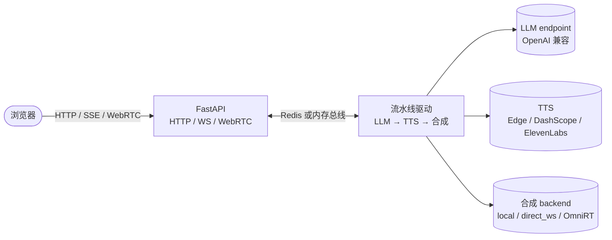

# OpenTalking

**面向实时数字人的开源编排层。**

OpenTalking 本身**不是** talking-head 模型，而是把 talking-head 模型与生产级实时对话
数字人所需的其它部分整合到一起的编排层：流式语音识别、大语言模型、语音合成、
WebRTC 推送，以及按会话粒度的控制。模型与 provider 组合可按部署需要替换，编排契约
保持不变。

[5 分钟开始 :material-rocket-launch:](user-guide/quickstart.md){ .md-button .md-button--primary }
[在线文档固定地址 :material-open-in-new:](https://datascale-ai.github.io/opentalking/){ .md-button }
[查看 GitHub 仓库 :material-github:](https://github.com/datascale-ai/opentalking){ .md-button }

在线文档默认中文，英文入口：<https://datascale-ai.github.io/opentalking/en/>

---

## OpenTalking 解决什么问题

构建一个能实时听说的数字人应用涉及大约十几个组件：带端点检测的语音识别、流式语言
模型客户端、句级语音合成、音频解码、talking-head 渲染、WebRTC track 管理、打断
处理、会话状态。OpenTalking 将上述能力实现为单一 FastAPI 服务，对外暴露一套简洁的
REST 与 WebSocket 接口，并按会话所选模型把合成委托给对应 backend。

如果问题是「我有一个 wav2lip 检查点，如何在其上提供实时对话体验」，OpenTalking
即为答案。若问题是「模型本身应该如何运行」，则按场景选择 backend：本地 adapter、
单模型 WebSocket、OmniRT，或用于自测的 mock。

## 关键能力

<div class="grid cards" markdown>

-   :material-account-voice: **实时对话流水线**

    ASR、LLM、TTS、talking-head 渲染与 WebRTC 推送串成一个可打断的会话链路。

-   :material-puzzle: **可插拔模型 backend**

    按 `model + backend` 选择 `mock`、`local`、`direct_ws` 或 `omnirt`，轻重模型不绑死同一平台。

-   :material-api: **统一 API**

    REST、SSE、WebSocket 与 WebRTC 信令统一收敛到 FastAPI 服务，前端和业务侧只对接一套接口。

-   :material-tune: **Provider 可替换**

    LLM 支持 OpenAI-compatible endpoint；TTS 可切换 Edge、DashScope、CosyVoice、ElevenLabs。

-   :material-account-convert: **Avatar 与音色管理**

    内置 avatar bundle、上传自定义形象、音色目录与声音复刻，适合做可配置数字人。

-   :material-server-network: **多部署形态**

    支持 `unified`、API/Worker 分离、Docker Compose，以及远端 OmniRT、GPU/NPU 模型服务。

</div>

## 选择起点

<div class="grid cards" markdown>

-   :material-flash: **快速上手**

    ---

    5 分钟流程：从源码克隆到 mock 合成路径下的首次端到端会话。

    [快速上手 →](user-guide/quickstart.md)

-   :material-cog: **配置说明**

    ---

    所有环境变量与 YAML 字段的参考，含默认值与优先级规则。

    [配置 →](user-guide/configuration.md)

-   :material-server-network: **部署指南**

    ---

    覆盖单进程、API/Worker 分离、Docker Compose、昇腾 910B 的部署拓扑。

    [部署 →](user-guide/deployment.md)

-   :material-api: **API 参考**

    ---

    REST、SSE 与 WebSocket 完整端点参考。

    [API 参考 →](api-reference/index.md)

-   :material-puzzle: **模型适配器**

    ---

    将新 talking-head 模型集成到 OpenTalking 的指南。

    [模型适配器 →](developer-guide/model-adapter.md)

-   :material-sitemap: **架构**

    ---

    系统架构、会话生命周期、事件总线参考。

    [架构 →](developer-guide/architecture.md)

</div>

## 最小示例

```bash title="终端"
git clone https://github.com/datascale-ai/opentalking.git
cd opentalking

uv sync --extra dev --python 3.11
source .venv/bin/activate
cp .env.example .env

# 在 .env 中配置 OPENTALKING_LLM_API_KEY 与 DASHSCOPE_API_KEY，然后执行：
bash scripts/quickstart/start_mock.sh
```

服务启动后，访问 <http://localhost:5173>，选择 `demo-avatar` 与 `mock` 模型即可
发起会话。启用真实 talking-head 合成时，配置目标模型的 backend，例如：

```yaml title="configs/default.yaml"
models:
  wav2lip:
    backend: omnirt
  quicktalk:
    backend: local
  flashhead:
    backend: direct_ws
```

只有 `backend: omnirt` 的模型需要配置 `OMNIRT_ENDPOINT`；前端交互流程无须变更。

## 系统架构



完整系统视图（组件、部署拓扑、会话生命周期、事件总线 schema）见
[架构](developer-guide/architecture.md)。

## OpenTalking 在生态中的定位

| 关注点 | OpenTalking | 合成 backend | 托管 LLM | TTS provider |
|--------|:-----------:|:------------:|:--------:|:------------:|
| 会话生命周期与状态 | ✓ | | | |
| HTTP 与 WebSocket API | ✓ | | | |
| WebRTC 信令与 track | ✓ | | | |
| 语音识别（通过 DashScope） | ✓ | | | |
| 句级流式流水线 | ✓ | | | |
| 打断传播 | ✓ | | | |
| 音色目录与复刻 | ✓ | | | |
| Avatar bundle 管理 | ✓ | | | |
| Talking-head 模型权重与推理 | | ✓ | | |
| GPU 与 NPU 调度与批处理 | | backend 支持时 ✓ | | |
| 对话补全推理 | | | ✓ | |
| 语音合成 | | | | ✓ |

## 适用场景

- **带可视化形象的对话助手**：客户支持、销售、新员工引导。
- **直播与广播应用**：数字人形象实时响应观众互动。
- **教育软件**：同时承载语音识别与语音反馈。
- **企业内部工具**：将企业内部的大模型与数字人界面结合。
- **科研与原型开发**：在 talking-head 生成研究中提供必要的编排层。

## 社区与支持

- **GitHub** —— [datascale-ai/opentalking](https://github.com/datascale-ai/opentalking)，提交 issue、pull request 与参与讨论。
- **QQ 交流群** —— `1103327938`（AI 数字人交流群），以中文社区为主。
- **文档** —— [用户指南](user-guide/quickstart.md)、[开发者指南](developer-guide/architecture.md)、[API 参考](api-reference/index.md)。
- **参与贡献** —— 提交规范见 [贡献指南](developer-guide/contributing.md)。

## 许可证

OpenTalking 遵循 Apache License 2.0。Talking-head 模型权重与外部模型服务各自
适用原始许可证，使用前请参阅对应模型仓库或 backend 部署的许可证条款。
