# 渲染管线

渲染管线将用户输入（或固定文本）转换为经 WebRTC 推送的音视频帧。本页说明各阶段流程、
打断机制与时延预算。

## 管线总览

```mermaid
flowchart LR
    User([用户麦克风]) -->|PCM 经 WebSocket| STT
    STT[语音识别<br/>Paraformer realtime] -->|transcript 事件| LLM
    LLM[语言模型<br/>OpenAI 兼容流式] -->|token delta| Splitter
    Splitter[分句器] -->|按句文本| TTS
    TTS[语音合成<br/>Edge / DashScope / ElevenLabs] -->|MP3 或 PCM 流| Decode
    Decode[ffmpeg PCM 解码] -->|16 位 PCM 片段| Adapter
    Adapter[合成适配器<br/>wav2lip / flashtalk / quicktalk] -->|视频帧| AV
    AV[AV 打包] -->|编码后媒体| WebRTC
    WebRTC([WebRTC track]) --> Browser([浏览器])
```

## 阶段说明

### 1. 语音识别

音频通过 WebSocket 端点 `speak_audio_stream` 或 HTTP 端点 `/transcribe` 送入服务。
DashScope `paraformer-realtime-v2` 模型输出部分识别结果，以 `transcript` 事件发送。
源码：`opentalking/stt/`。

### 2. 语言模型生成

最终识别文本提交至 OpenAI 兼容对话补全端点。token 以流式方式返回，并以 `llm` 事件
再次发出，便于客户端显示。源码：`opentalking/llm/`。

### 3. 分句

语言模型 token 持续累积，直至检测到句末（`。`、`！`、`？`、`.`、`!`、`?` 或换行）。
每个完整句子立即触发一次语音合成调用，使得播放可以在完整回复生成完成之前开始。

### 4. 语音合成

语音合成适配器按 provider 支持的格式流式返回音频：

- **Edge** —— MP3 片段。
- **DashScope Qwen realtime** —— WebSocket 上的 PCM 帧。
- **ElevenLabs** —— MP3 或 PCM，取决于 `output_format` 配置。
- **CosyVoice** —— 通过 DashScope 云服务返回 MP3 或 WAV。

源码：`opentalking/tts/`。

### 5. 音频解码

provider 返回 MP3 时，长期运行的子进程
`ffmpeg -f mp3 -i - -f s16le -ar 16000 -ac 1 -` 将其解码为 16 位 PCM。PCM 流被切分为
`AudioChunk` 实例（默认时长 20 ms）。片段衔接处的淡入淡出时长由
`OPENTALKING_FLASHTALK_TTS_BOUNDARY_FADE_MS` 控制。源码：`opentalking/tts/adapters/`。

### 6. 合成适配器

每个 `AudioChunk` 提交给已注册的 `ModelAdapter`，依次调用 `extract_features`、`infer`、
`compose_frame`。适配器按 avatar 的 `fps` 字段输出视频帧（典型值 25）。详见
[模型适配器](../developer-guide/model-adapter.md)。

对于远端合成后端（`flashtalk`、OmniRT 承载的 `wav2lip` 与 `musetalk`），适配器实现为
WebSocket 薄客户端，推理在模型服务端执行。

### 7. AV 打包与 WebRTC 推送

`opentalking/rtc/` 将 PCM 音频与合成视频帧封装为 `RTCAudioFrame` 与 `RTCVideoFrame`，
然后写入已配置的 WebRTC track。浏览器通过 `apps/web` 中的 `<video>` 元素播放音视频。

## 打断（barge-in）

`POST /sessions/{id}/interrupt` 在会话上置取消标志。管线在各阶段之间检查该标志：

1. 语言模型流 —— 停止读取后续 token，关闭连接。
2. 分句器 —— 丢弃进行中的句子。
3. 语音合成 —— 终止上游 WebSocket，结束 ffmpeg 子进程。
4. 合成适配器 —— 当前片段的帧排空后回到 idle 状态。
5. WebRTC —— track 保持开放，由 idle 帧接管。

打断后约 200 ms 内管线回到 idle 状态。

## 时延预算

下述数据基于单张 NVIDIA 4090、Edge TTS 与 FlashTalk-14B 的实测。

| 阶段 | 时延贡献 |
|------|---------|
| 语音识别部分结果到最终结果 | 300–600 ms（取决于语音端点检测） |
| 语言模型首个 token | 200–500 ms |
| 语言模型 token 到句末 | 单句文本时长 |
| 语音合成首段音频 | 150–400 ms |
| 音频片段到首个合成帧 | 80–180 ms |
| 帧入队到 WebRTC 播放 | < 50 ms（浏览器侧抖动） |

语音结束到首个 avatar 帧的端到端时延通常为 700–1500 ms。主要影响因素为语言模型：
`qwen-flash` 比 `qwen-plus` 更快；本地 Ollama 部署在模型已加载时可实现 100 ms 以内的
首 token 时延。

## 源文件

| 文件 | 阶段 |
|------|------|
| `opentalking/stt/` | 语音识别适配器。 |
| `opentalking/llm/` | 语言模型流式客户端。 |
| `opentalking/worker/` | 管线编排，包含分句与扇出。 |
| `opentalking/tts/adapters/` | 语音合成 provider 实现。 |
| `opentalking/models/quicktalk/` 及相关目录 | 合成适配器。 |
| `opentalking/rtc/` | WebRTC track 与帧队列管理。 |
| `apps/api/routes/sessions.py` | 驱动与控制管线的端点。 |
